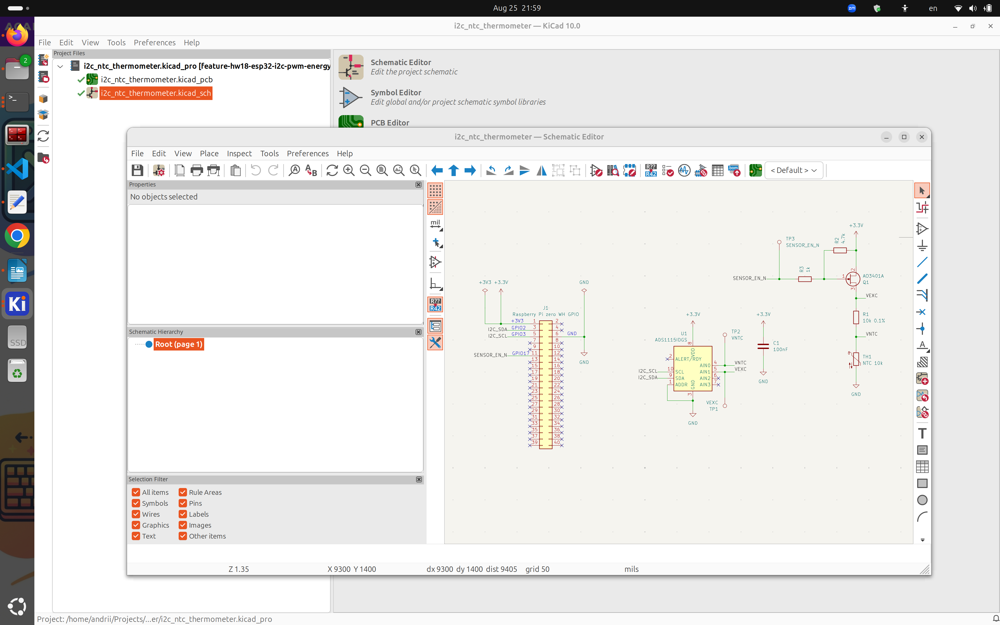
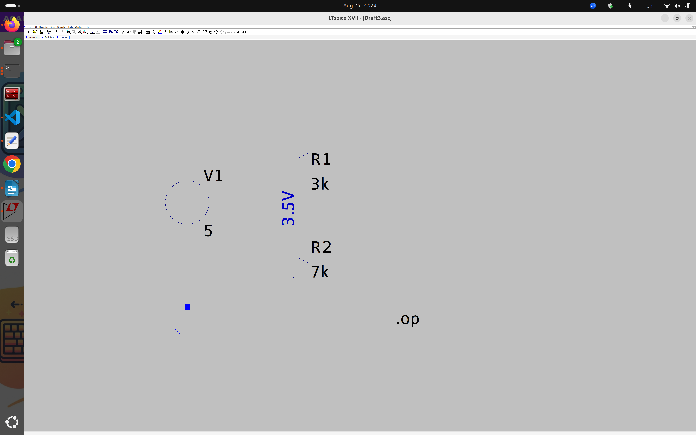
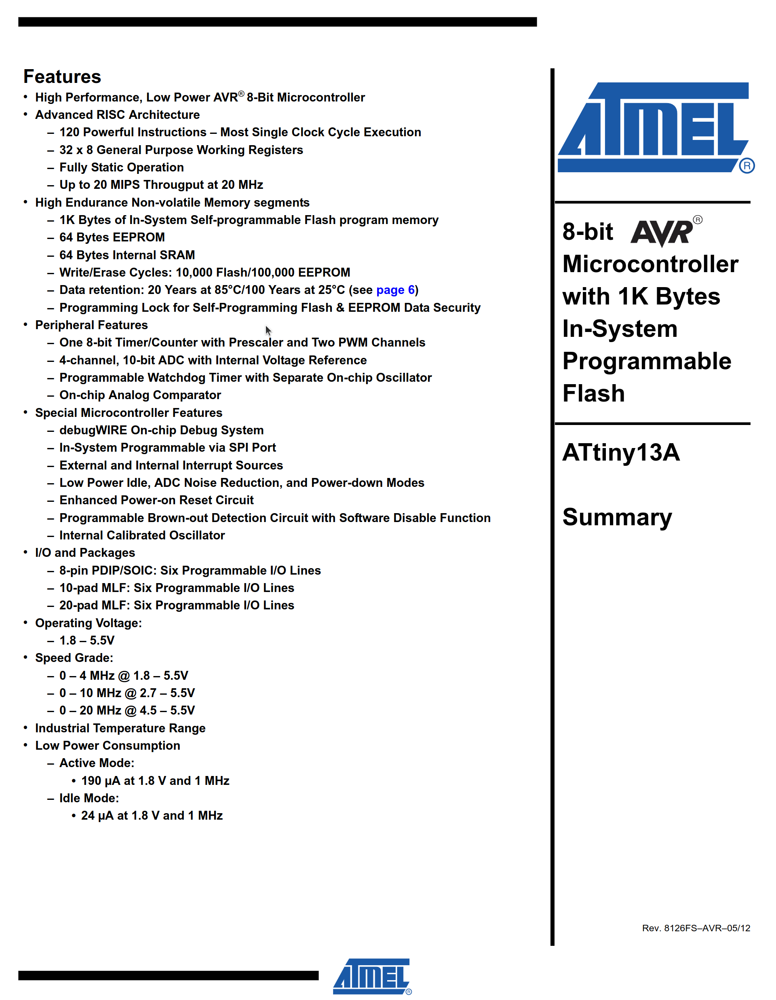
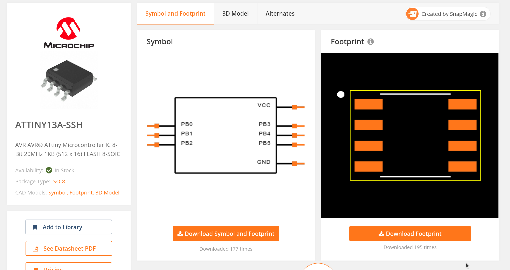
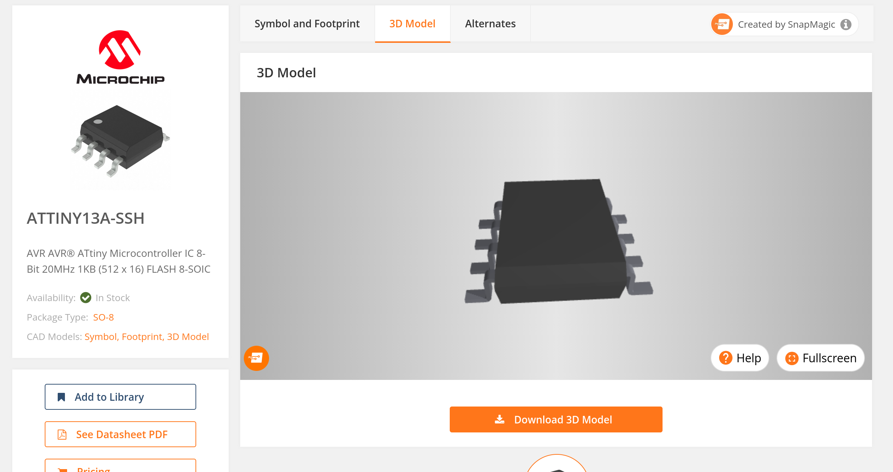

# Заняття 1: Робоче середовище, пошук компонента (datasheet, символ, footprint, 3D)

Скріншот головного вікна:

Microchip ATTINY13A-SSH

1\. Datasheet (Технічний опис)

<https://octopart.com/datasheet/microchip/ATTINY13A-SSH>

2\. Схематичний символ (Schematic Symbol)

<https://www.snapeda.com/parts/ATTINY13A-SSH/Microchip/view-part/>

3\. PCB Footprint (Посадкове місце на платі)

<https://www.snapeda.com/parts/ATTINY13A-SSH/Microchip/view-part/>

4\. 3D Model (STEP)

<https://www.snapeda.com/parts/ATTINY13A-SSH/Microchip/view-part/>

