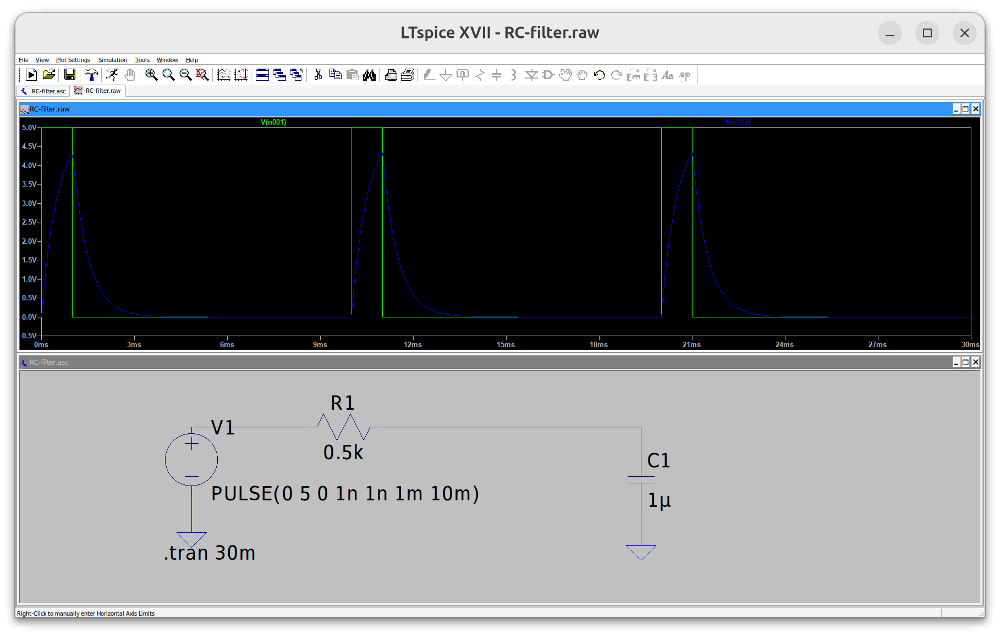
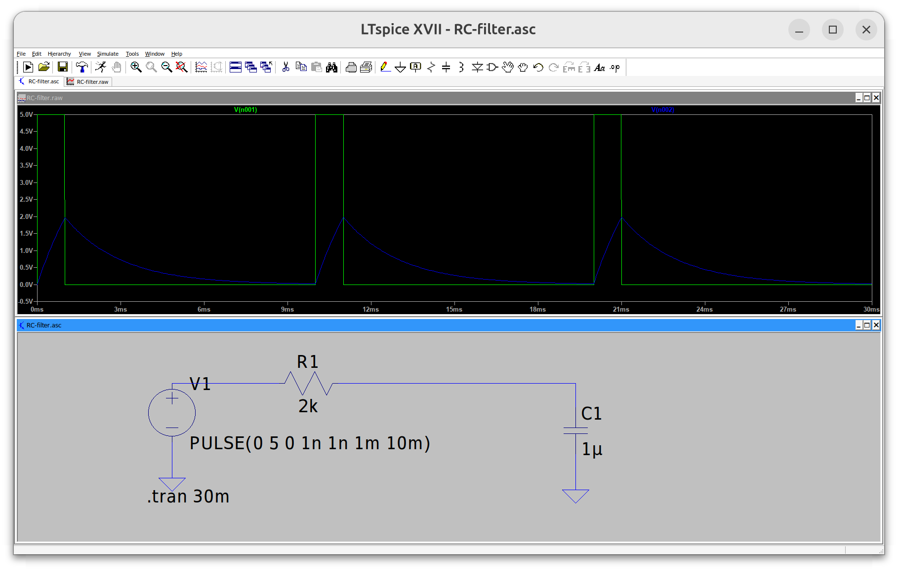
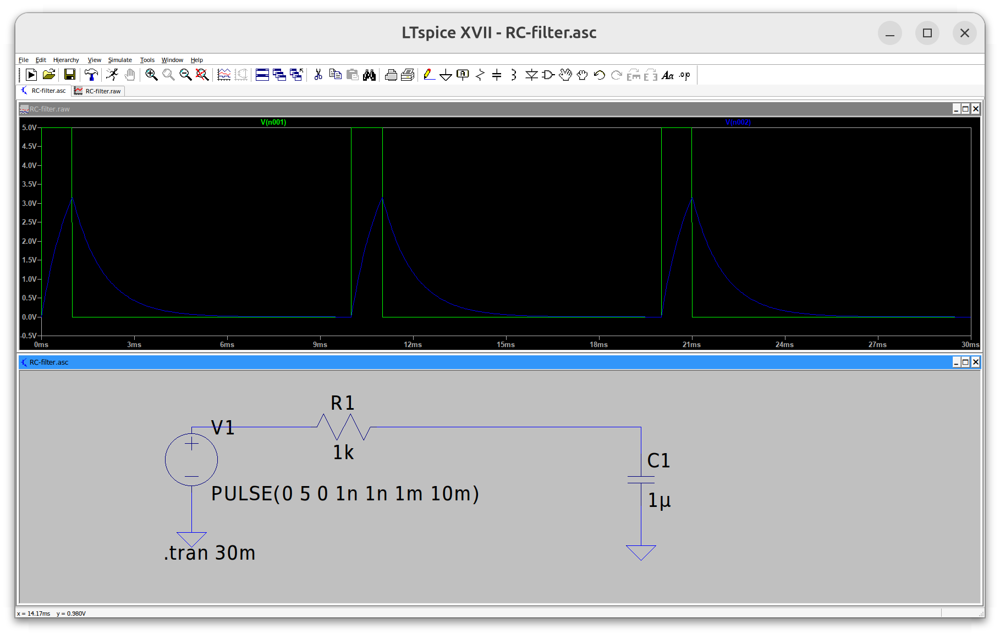
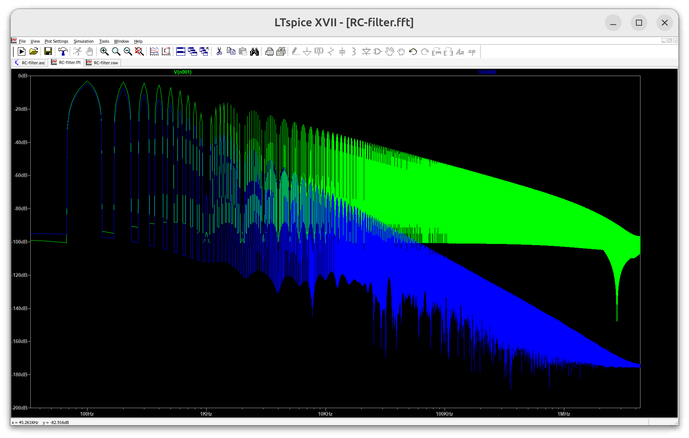
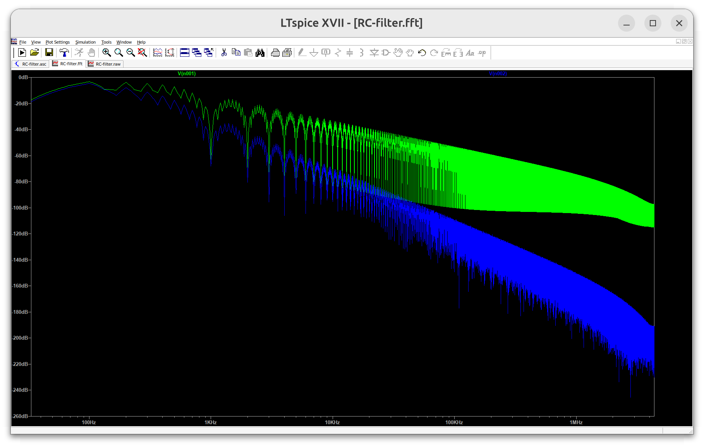
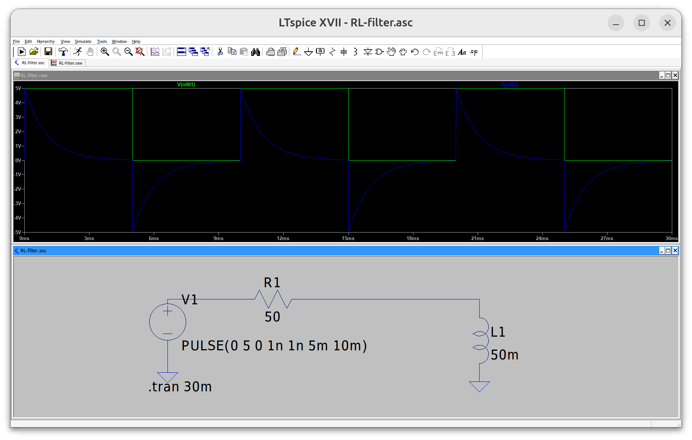
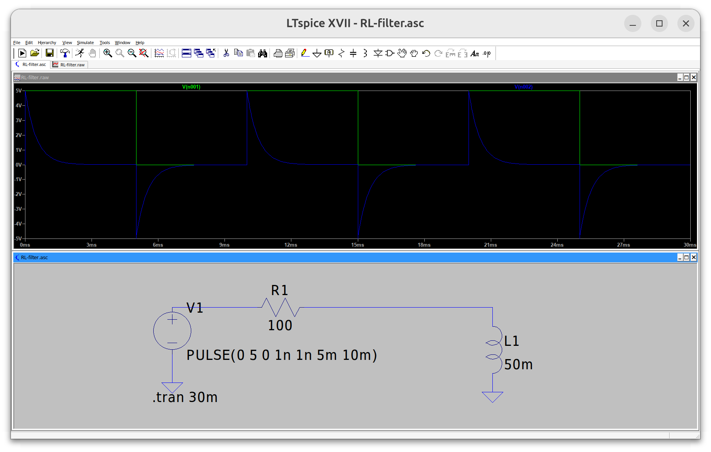
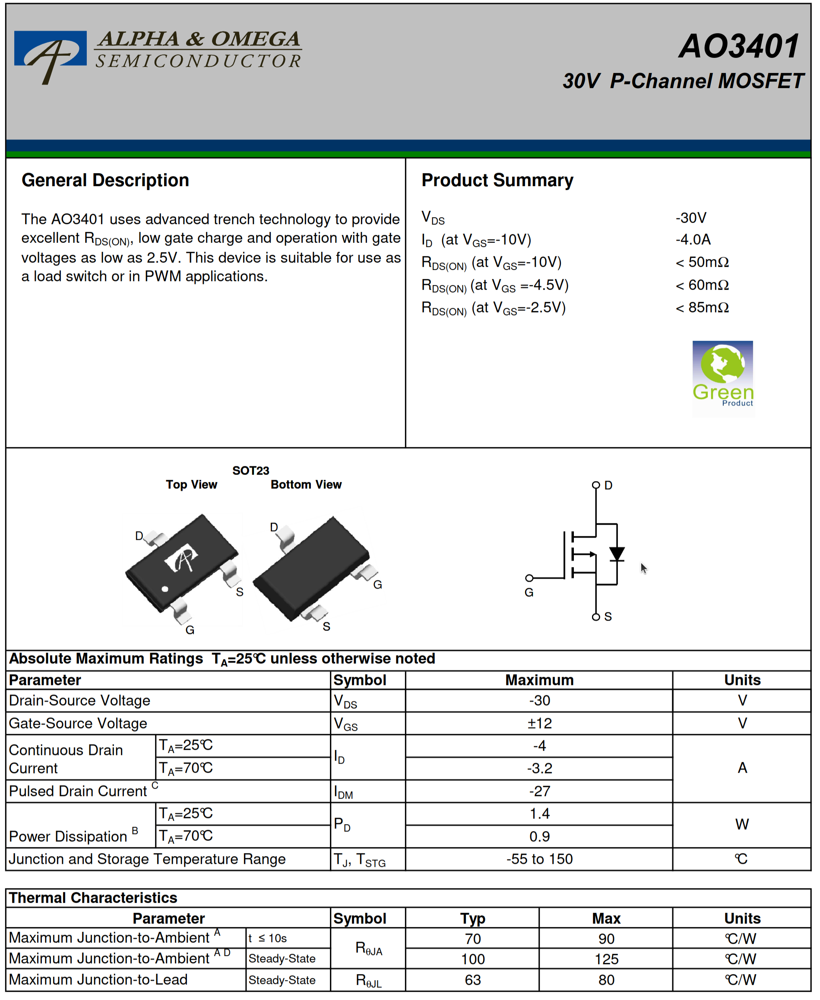
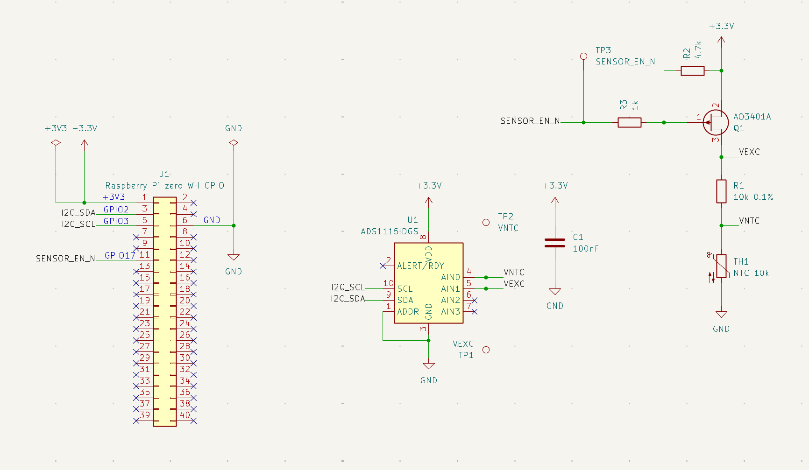

# Заняття 2: Основні поняття в електроніці.

### Завдання

1\. Подаючи прямокутний сигнал, просимулюйте роботу **RC-ланцюга**, змінюючи параметри компонентів (збільшіть R×2, зменшіть R, зменшіть C).

2\. Подаючи прямокутний сигнал, просимулюйте роботу **RL-ланцюга**, змінюючи параметри компонентів.

3\. Знайдіть Datasheet будь-якого **MOSFET** і випишіть: максимальну напругу, максимальний струм, корпус.

1)  RC-ланцюг, джерело сигналу – тривалість 1мс, період 10мс:

    1)  Зміна опору резистора:

- з параметрами R1 0.5k, C1 1u

Результат – пікі сигналу доходять до 4В

- з параметрами R1 1k, C1 1u

Результат – пікі сигналу доходять до 3В

- з параметрами R1 2k, C1 1u

Результат: пікі сигналу доходять до 2В

Висновок – від опору резистора залежить як швидко конденсатор буде заряджатися або розряджатися в ланцюгу. Чим більше значення, тим довше заряджається конденсатор і тим ніжчі пікі.

1)  Зміна ємності конденсатора:

- з параметрами R1 1k, C1 0.5u

Результат – пікі сигналу доходять до 4В

- з параметрами R1 1k, C1 1u

Результат – пікі сигналу доходять до 3В

- з параметрами R1 1k, C1 2u

Результат: пікі сигналу доходять до 2В

Висновок – від ємності конденсатора залежить як швидко він буде заряджатися або розряджатися в ланцюгу. Чим більше значення, тим довше заряджається конденсатор і тим ніжчі пікі.

1)  FFT перетворення для схеми з параметрами R1 1k, C1 1u. Зеленим кольором видно АЧХ вхідного сигналу, синім – вихідного (на конденсаторі):

Ось графіки FFT з параметром Windowing → Blackman-Harris (намагався зробити сигнал більш візуальним):

Висновок: RC-коло є фільтром нижніх частот – видно як після проходження через елементи падає рівень високих частот. Чим вище частота, тим менше супротив конденсатора і тим ближче до землі (GND) наближується вивід конденсатора.

2)  Основні параметри розрахунку:

    1)  Частота зрізу

Fc = 1 / (2\*Pi\*R\*C) = 1÷(2×π×1000×0.000001) = 159.154943092 Гц

Це означає: На цій частоті амплітуда вихідного сигналу зменшиться на 3дБ (становить близько 70% від вхідної напруги).

2)  Стала часу tau:

tau = R \* C = 0.001

Це означає: Це час, за який конденсатор зарядиться до 63.2% від максимальної напруги (або розрядиться до 36.8% при подачі прямокутного імпульсу.

Вважається що повний заряд/розряд триває приблизно 5 \* tau = 5 мс.

Це значення приблизне, бо цей процес триває по експоненті і повний заряд означає 99.3% заряду від максимально можливого.

2)  RL-ланцюг, джерело сигналу – тривалість 5мс, період 10мс:

    1)  Зміна опору резистора:

- з параметрами R1 50, L1 50m (50 мілігенрі)

Результат: сигнал на виході зникає за 3.5 мс після зміни з 0 до 1 і навпаки.

- з параметрами R1 100, L1 50m

Результат: сигнал на виході зникає за 2.5 мс після зміни з 0 до 1 і навпаки.

- з параметрами R1 200, L1 50m

Результат: сигнал на виході зникає за 1 мс після зміни з 0 до 1 і навпаки.

1)  Зміна індуктивності:

- з параметрами R1 100, L1 25m

Результат: сигнал на виході зникає за 1 мс після зміни з 0 до 1 і навпаки.

- з параметрами R1 100, L1 50m

Результат: сигнал на виході зникає за 2.5 мс після зміни з 0 до 1 і навпаки.

- з параметрами R1 100, L1 100m

Результат: сигнал на виході зникає за 3.5 мс після зміни з 0 до 1 і навпаки.

Висновок – від індуктивності котушки залежить як швидко він буде зменшувати сигнал на виході. Чим більше значення, тим довше падає сигнал.

3)  Пошук datasheet для MOSFET AO3401:

Знайшов на сайті https://octopart.com/datasheet/alpha-omega-semiconductor/AO3401

максимальна напруга (Drain-Source Voltage, Vds): -30 В

максимальний струм (Continious Drain Current, Id): -4А

корпус (Package): SOT23

На ньому я реалізовував ключ для вимірювання температури за допомогою ратиометрії:
