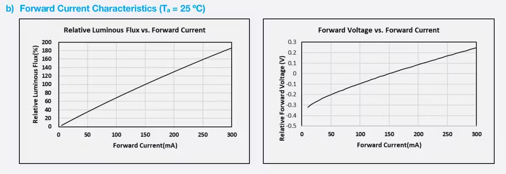
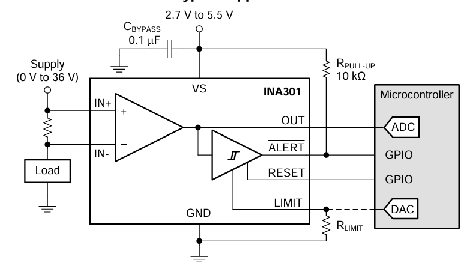
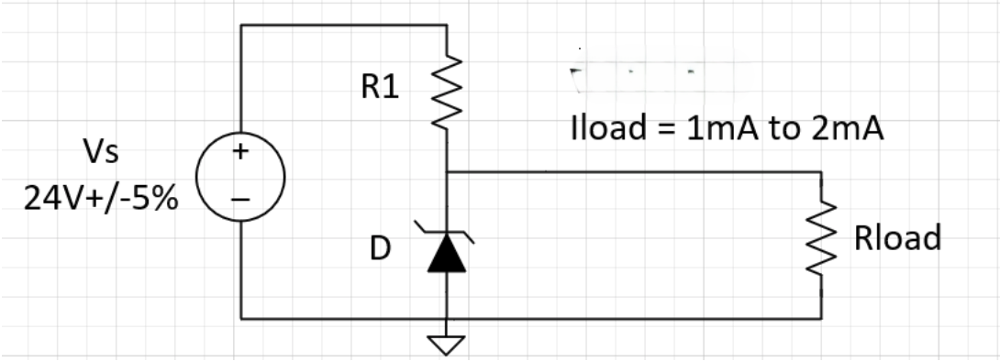

# Заняття 3: Компонентна база: пасивні та активні компоненти.

### Завдання 1

1\. Варіант 1: Розрахуйте резистор для світлодіода SMD 2835 0,2 W

Знайшов його datasheet: <https://www.bridgelux.com/sites/default/files/ds1458.pdf>

Для нього характерні такі показники:

- Drive Current (mA): 20

- Forward Voltage (V): 2.64

Якщо напруга в нас 3.3 В, то розраховуємо резистор:

Віднімаємо від вхідної напруги значення Forward Voltage, отримуємо 3.3-2.64=0.66 В.

Для обмеження струму 20 мА потрібен наступний опір резистора:

U = R \* I --\> R = U/I = 0.66/0.02 = 33 Ом

Розрахуємо потужність резистора:

P = U \* I = 0.66 \* 0.02 = 0.0132 Вт — підійде резистор любої потужності, наприклад 0.125 Вт.

1\. Варіант 2: Розрахуйте резистор для світлодіода SMD 2835 SPMWH1228FD5WARUVG, напруга живлення 3,3 В, необхідна відносна потужність світлового потоку — 10% (забезпечується 10 мА).

Його datasheet знаходиться [тут](https://docs.superhuman.com/d/Hardware-Development_d5LyHpQBKAp/3_suPyynB0#_lubhjPNX).

Для нього характерні такі показники:

- Product Code Information - SPMWH1228FD5WARUVG

|           |                              |          |                          |
|:---------:|:----------------------------:|:--------:|:------------------------:|
| **Digit** |     **PKG Information**      | **Code** |    **Specification**     |
|   1 2 3   | Samsung Package Middle Power |   SPM    |       Middle Power       |
|    4 5    |            Color             |    WH    |          White           |
|     6     |       Product Version        |    1     |      Without Zener       |
|   7 8 9   |         Form Factor          |   228    | 2.8 x 3.5 x 0.7; 2 pads  |
|    10     |     Sorting Current (mA)     |    F     |          150 mA          |
|    11     |   Chromaticity Coordinates   |    D     |      ANSI Standard       |
|    12     |             CRI              |    5     |         Min. 80          |
|   13 14   |     Forward Voltage (V)      |    WA    | 2.8-3.1, 4000ea per reel |
|   15 16   |           CCT (K)            |    RU    |           5000           |
|   17 18   |        Luminous Flux         |    VG    |            VG            |

- Sorting Current (mA): 150

- Forward Voltage VF (V): Bin нам невідомий, тому вибираємо середнє значення між 2.8 - 3.1 = 2.95

Якщо напруга в нас 3.3 В, то розраховуємо резистор:

Віднімаємо від вхідної напруги значення Forward Voltage VF, отримуємо 3.3-2.95=0.35 В.

Для обмеження струму 10 мА потрібен наступний опір резистора:

U = R \* I --\> R = U/I = 0.35/0.01 = 35 Ом. Вибираємо найближчий більший номінал = 36 Ом.

Розрахуємо потужність резистора:

P = I2 \* R = 0.01 \* 0.01 \* 36 = 0.0036 Вт — множимо на 2 і отримуємо 72 мВт. Вибираємо корпус по таблиці: SMD 0603 потужністю 0.1 Вт.

2\. Розрахуйте подільник напруги 12 В → 3 В (струм 40 мА)

Розраховуємо суму опору дільника в цілому: R = U/I = 12/0.04 = 300 Ом

Розраховуємо опір нижнього резистора: Rн = U/I = 3/0.04 = 75 Ом

Розраховуємо опір верхнього резистора: Rв = R - Rн = 300 - 75 = 225 Ом

### Завдання 2 — INA301A2

Дано підсилювач [INA301A2 (datasheet TI)](https://www.ti.com/lit/ds/symlink/ina301.pdf?ts=1784212280368&ref_url=https%253A%252F%252Fwww.ti.com%252Fproduct%252FINA301).

Розрахуйте шунт (опір і корпус відповідно до розсіюваної потужності) для виміру струму навантаження, який максимально може бути 2 А. Напруга живлення навантаження — 12 В, напруга живлення підсилювача/MCU — 3,3 В. Додатково розрахуйте RLIMIT.

Подивимося на datasheet.

Напруга живлення навантаження 12 В списується в діапазон вхідної напруги: від 0 В до 36 В.

- Коефіцієнт підсилення напруги мікросхеми (Voltage Gain): 50 V/V.

При живленні VS = 3.3 В вихід INA301 не доходить гарантовано до 3.3 В. Datasheet дає swing до позитивної шини приблизно VS - 0,05 V типово і VS - 0,1 V у гіршому випадку. Крім того, параметри gain error та nonlinearity нормуються в області лише від 0,5 V до VS - 0,5 V. Тому для коректного вимірювального розрахунку краще закладати верхню робочу напругу близько Vout = 3.3 - 0.5 = 2.8 V.

- Згідно datasheet максимальна диференційна напруга на вході дорівнює = 100 мВ = 0.1 В. Але в нашій схемі робочий діапазон буде меншим через живлення 3.3 В. При розрахунку від Vout розрахункова диференційна напруга на вході дорівнює V in max = Vout/Gain = 2.8/50 = 0.056 В (беремо менше значення з двох - 0.056 В та 0.1 В).

- Максимальне падіння напруги на шунті дорівнює V sense = V in max = 0.056 В.

- Розраховуємо опір шунта: R sense = V in max/I load = 0.056/2 = 0.028 Ом. Вибираємо стандартне значення R sense = 0.027 Ом.

- Розраховуємо розсіювану потужність: P sense = Imax2 \* R sense = 22 \* 0.027 = 0.108 Вт. Реальну потужність потрібно забезпечити з запасом – помножимо на 2. P sense = 0.108 \*2 = 0.216 Вт.

- Корпус резистора дивимося в таблиці (SMD Resistor Power Rating Chart (0201 to 2512 Packages)) на сайті <https://jlcpcb.com/blog/resistor-power-rating> - найближчий резистор що підійде - потужністю 0.25 Вт, але для шунта я би взяв з запасом — потужністю 0.5 Вт: SMD 1210.

- Для розрахунку R limit виконуємо розрахунок згідно таблиці внизу що буде дорівнювати 37500 Om. Серед найближчих з точністю E96 підходять значення 33.2 kOm та 34 kOm. Якщо вибирати 33.2 kOm, то сигнал помилки спрацює раніше за максимальний струм в 2 А і буде дорівнювати 1.97 А (розрахунок під таблицею), що менше граничного значення на -1.5%. Якщо поставити більше значення 34 kOm, то значення струму перевищить 2 А і буде дорівнювати 2.02 А, що означає перевищення граничного значення на 1%. Правильне рішення - вибираємо значення 33.2 kOm з резисторів точністю E96 тому що струм краще обмежувати знизу і не перевищувати максимальне значення 2 А. В даному випадку при струмі 1.97 А спрацює інверсний вихід сповіщення ALERT що дозволить швидко виявити подію перевантаження по струму.

<table>
<colgroup>
<col style="width: 9%" />
<col style="width: 55%" />
<col style="width: 35%" />
</colgroup>
<tbody>
<tr>
<td colspan="2" style="text-align: center;"><strong>PARAMETER</strong></td>
<td style="text-align: center;"><strong>EQUATION</strong></td>
</tr>
<tr>
<td rowspan="2" style="text-align: center;">V trip</td>
<td rowspan="2" style="text-align: center;">V out at the desired current trip value 
Порогова напруга захисту</td>
<td style="text-align: center;">I load * R sense * Gain</td>
</tr>
<tr>
<td style="text-align: center;">2 A * 0.027 Ом * 50 V/V = 2.7 V</td>
</tr>
<tr>
<td rowspan="2" style="text-align: center;">V limit</td>
<td rowspan="2" style="text-align: center;">
Threshold limit voltage

Порогова напруга обмеження
</td>
<td style="text-align: center;">V limit = V trip</td>
</tr>
<tr>
<td style="text-align: center;">2.7 V</td>
</tr>
<tr>
<td rowspan="2" style="text-align: center;">I limit</td>
<td rowspan="2" style="text-align: center;">
Limit threshold output current

Граничний вихідний струм
</td>
<td style="text-align: center;">I limit from datasheet</td>
</tr>
<tr>
<td style="text-align: center;">80 мкА</td>
</tr>
<tr>
<td rowspan="2" style="text-align: center;">R limit</td>
<td rowspan="2" style="text-align: center;">
Calculate the threshold limit-setting resistor

Розрахувати резистор, що задає поріг обмеження
</td>
<td style="text-align: center;">V limit / I limit</td>
</tr>
<tr>
<td style="text-align: center;">2.7 V / 0.00008 A = 33750 Om</td>
</tr>
</tbody>
</table>

**Розрахунок струму через навантаження при R limit = 33.2 kOm:**

V trip = I load \* R sense \* Gain

V limit = V trip

R limit = V limit / I limit = V trip / I limit = I load \* R sense \* Gain / I limit

R limit = I load \* R sense \* Gain / I limit

R limit \* I limit = I load \* R sense \* Gain

I load \* R sense \* Gain = R limit \* I limit

Тоді значення I load можна порахувати наступним чином:

I load 33.2к = R limit \* I limit / (R sense \* Gain) = 33200 Om \* 0.00008 A / (0.027 Om \* 50 V/V) = 1.97 А

Відхилення від максимального струму навантаження = (I load 33.2к - I load) / I load \* 100% = (1.97 – 2) / 2 \* 100 = -1.5%.

**Розрахунок струму через навантаження при R limit = 34 kOm:**

I load 34к = R limit \* I limit / (R sense \* Gain) = 34000 Om \* 0.00008 A / (0.027 Om \* 50 V/V) = 2.02 А

Відхилення від максимального струму навантаження = (I load 34к - I load) / I load \* 100%= (2.02 – 2) / 2 \* 100 = 1%.

### Завдання 3 — BZX84WC

Паралельно до навантаження стоїть [BZX84WC15V (datasheet TI)](https://www.ti.com/lit/ds/symlink/bzx84wc15v.pdf?ts=1784270962931&ref_url=https%253A%252F%252Fwww.ti.com%252Fproduct%252FBZX84WC15V). На навантаженні має бути **15 В**, струм min **1 мА**, max **2 мА**.

Розрахуйте номінал і корпус резистора R1, перевірте, чи підходить стабілітрон по потужності.

BZX84WC15V:

|  |  |  |  |
|:--:|:--:|----|----|
| Zener VoltageVZ (V) at IZ | Напруга стабілітрона (В) | MIN | 14.25 |
|  |  | TYP | 15.00 |
|  |  | MAX | 15.75 |
|  |  | IZ (mA) | 5.00 |
| Zener ImpedanceZZT (Ω) at IZ | Опір стабілітрона (Ом) | MAX | 30.00 |
|  |  | IZ (mA) | 5.00 |
| Reverse Leakage CurrentIR (μA) | Зворотний струм витоку (мкА) | MAX | 0.03 |
|  |  | VR (V) | 10.50 |
| Temperature CoefficientSZ (mV/C) at IZ | Температурний коефіцієнт (мВ/C) | MAX | 13.00 |
|  |  | IZ (mA) | 5.00 |
| CapacitanceC D (pF) | Ємність (пФ) | MAX | 50.00 |

1.  Визначення діапазону вхідної напруги

Вхідна напруга Vs = 24 V +/- 5%:

- Мінімальна напруга Vs min = 24 \* 0.95 = 22.8 V

- Максимальна напруга Vs max = 24 \* 1.05 = 25.2 V

Напруга на стабілітроні (і навантаженні) становить Vz = 15 V.

2.  Розрахунок номіналу резистора R1

    Струм через навантаження Iload = {.min = 1mA, .max = 2mA}. Для стабільної роботи стабілітрона через нього повинен проходити певний мінімальний струм. В даному випадку нам потрібно використовувати струм Iz = 5 mA з datasheet при якому надаються основні параметри стабілітрона. Розглянемо коли Iz = 5 mA.

    Проробляємо найгірший сценарій для стабілізації коли вхідна напруга мінімальна (Vs min = 22.8 V), а струм навантаженні - максимальний (Iload max = 2mA).

- Струм через резистор R1 в найгіршому випадку:
  IR1 MAX = Iz + Iload max = 5 + 2 = 7 mA.

- Максимально допустимий опір R1:
  R1 max = (Vs min - Vz) / IR1 MAX = (22.8 - 15) / 0.007 = 1114.29 Om. Оскільки номінал має бути меншим або дорівнювати 1.114 kOm, обираємо найближче менше стандартне значення з ряду E24.

- Вибраний номінал R1: 1.1 kOm.

3.  Перевірка стабілітрона та резистора по потужності

    Проведемо перевірку в режимі максимального навантаження – максимальною напругою на вході (Vs max = 25.2 V) і максимальним струмом навантаження (Iload_max = 2mA). Зробимо розрахунок для вибраного номінала резистора R1 = 1.1 kOm:

- Максимальний струм через резистор:
  IR1 MAX = (Vs max - Vz) / R1 = (25.2 V - 15 V) / 1100 Om = 0.0093 = 9.3 mA.

- Максимальний струм через стабілітрон:
  IZ MAX = IR1 MAX - Iload min = 9.3 mA - 1mA = 8.3 mA.

- Максимальна потужність що розсіюється на стабілітроні:
  PZ MAX = Vz \* IZ MAX = 15 V \* 8.3 mA = 15 \* 0.0083 = 0.1245 Вт ≈ 125 мВт.

- Максимальна потужність на резисторі R1:
  PR1 MAX = (Vs max - Vz) / IR1 MAX = (25.2 V - 15 V) / 9.3 mA = 0.09486 Вт ≈ 95 мВт.

4.  Вибір корпусів компонентів:

- **Стібілітрон BZX84WC15V:** поставляється в корпусі SC-70 і має максимальну розсіювану потужність 360 мВт і може витримувати потужність 125 мВт що необхідна для нашої схеми.

- **Резистор R1:** оскільки максимальна потужність на ньому становить 95 мВт а з запасом в 2 рази це буде 0.19 Вт, то вибираємо такий тип корпусу що витримує необхідну потужність - SMD 1206 на 0.25 Вт.
