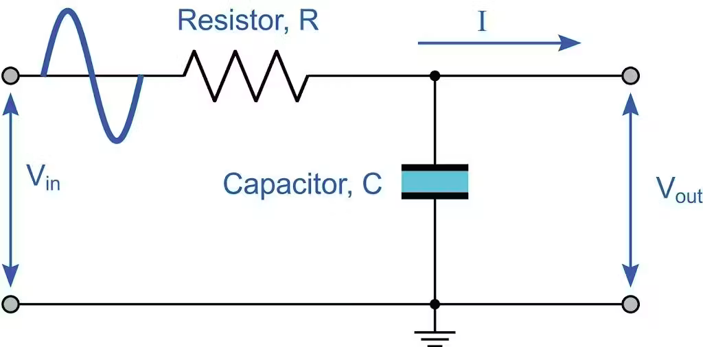
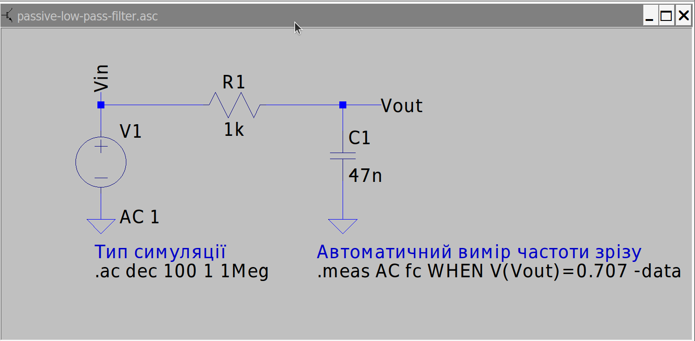
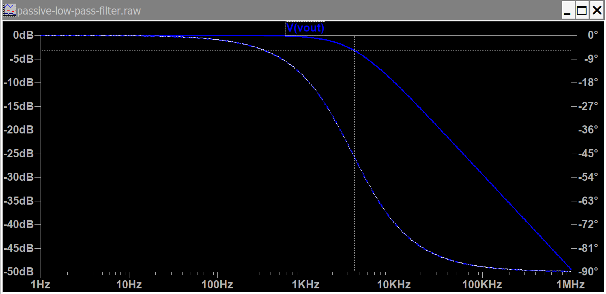
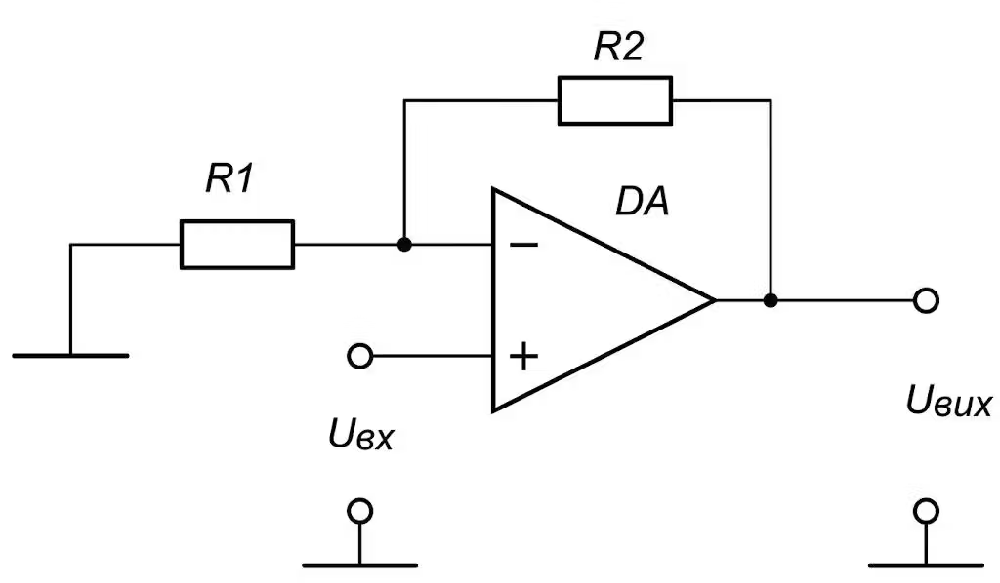
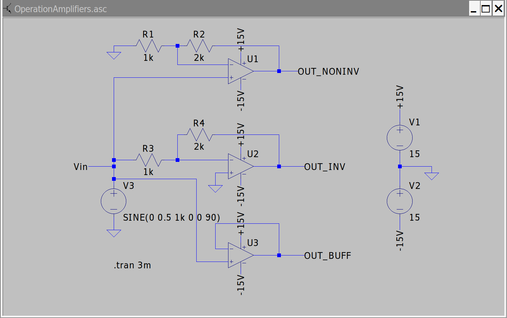
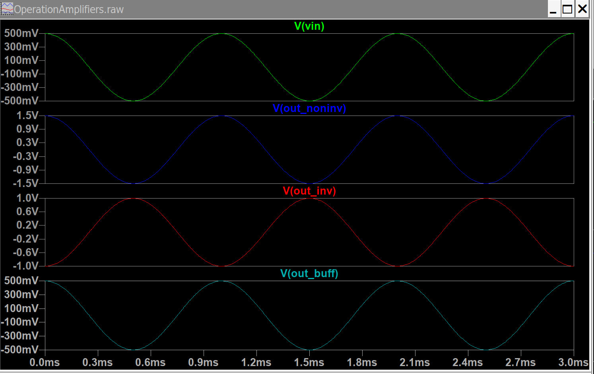
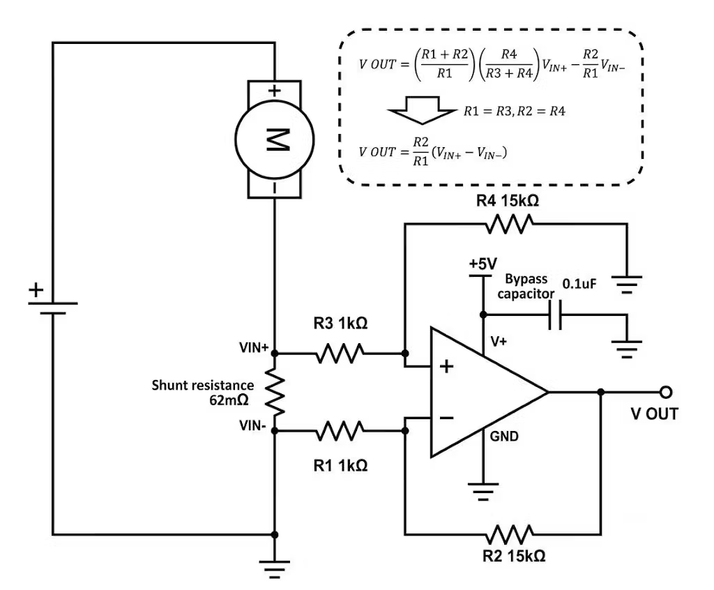
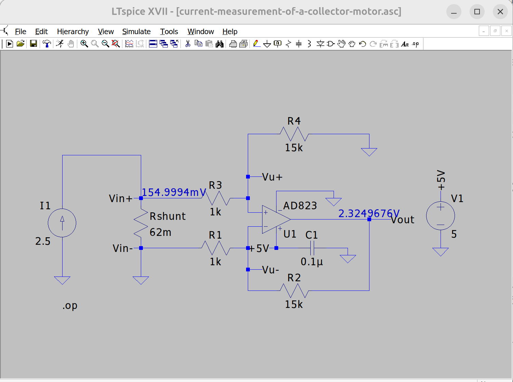
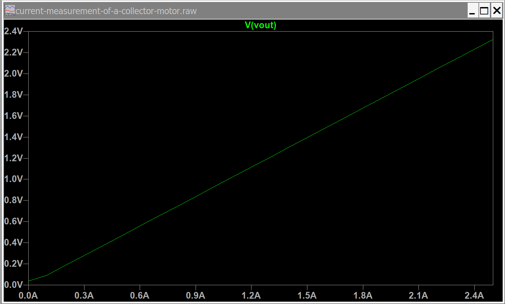
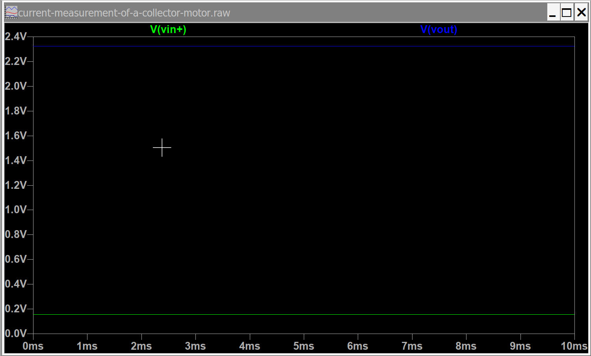

# Заняття 4: Аналогова схемотехніка. Симуляції схем.

### Завдання 1 — пасивний фільтр низьких частот

Дано: C = 47 нФ, R = 1 кОм

Розрахуйте частоту зрізу (cut-off frequency) fc.

Схема пасивного фільтра низьких частот:

1)  Частота зрізу:

- Формула для розрахунку:
  Частота зрізу — це частота, на якій реактивний опір конденсатора (Xc = 1/(2\*Pi\*F\*C)) стає рівним опору резистора R.
  Тобто Xc = 1/(2\*Pi\*F\*C) = R --\> Fc = 1 / (2\*Pi\*R\*C)

- Розрахунок частоти зрізу:
  Fc = 1 / (2\*Pi\*R\*C) = 1÷(2×π×1000×0.000000047) ≈ 3386.28 Гц ≈ 3.39 кГц

Чомусь не вдалось автоматично відобразити на графіку частоту зрізу (можливо стара версія додатку), тому зробив це вручну — приблизно виставив значення (дві білі переривчаті прямі — горизонтальна та вертикальна):

Це означає: На цій частоті амплітуда вихідного сигналу зменшиться на 3дБ (становить близько 70% від вхідної напруги).

На графіку також видно фазовий зсув у часі. В точці частоти зрізу настає баланс сил — активний опір резистора (R) дорівнює реактивному опору конденсатора (Xc = 1кОм). Оскільки вони ділять напругу порівну, схема є наполовину активною (резистивною) та наполовину реактивною (ємнісною). Але резистор дає зсув фази 0 градусів, конденсатор -90 градусів, то середнє значення в цій точці ми отримуємо -45 градусів.

Другий варіант розрахунку — зсув фази розраховується як арктангенс відношення опорів:
Fi = -arctan(R / Xc). Оскільки на частоті зрізу R = Xc, то:
Fi = -arctan(1) = -45 градусів.

### Завдання 2 — тип та параметри підсилювача

Дано: R2 = 12 кОм, Ku = 37

Розрахуйте параметри підсилювача, визначте його тип.

- Розрахунок параметрів підсилювача:

Коефіцієнт підсилення Ku = 1 + R2 / R1 = 37

Отримуємо формулу: 1 + R2 / R1 = 37 --\> R2 / R1 = 37 - 1 --\> R2 = 36 \* R1 --\>

R1 = R2 / 36 = 12k / 36 = 1k/3 = 333 Ом ≈ 330 Ом

Перевірка: Ku = 1 + R2 / R1 = 1 + 12000 / 330 ≈ 37.36 ≈ 37

- Визначення типу підсилювача:

  Змоделював 3 типи підсилювачів — неінвертуючий, інвертуючий та повторювач напруги (буфер):

З усіх типів самий схожий на наш - U1: **неінвертуючий** підсилювач (хоча перший раз я подумав що це був інвертуючий ☺).

  Отримав наступні графіки:

Де vin - вхідна напруга = 0.5 вольт на самому початку,

out_noninv - вихід неінвертуючого підсилювача = 1.5 вольта (Ku =1 + 2/1 = 3)

out_inv - вихід інвертуючого підсилювача = -1.0 вольт (Ku =- 2/1 = -2)

out_buff - вихід повторювача напруги (буфера) = 0.5 вольт (Ku = 1)

### Завдання 3 — замір струму колекторного двигуна

Є схема заміру струму колекторного двигуна. Підсилювач AD823A. Очікуваний максимальний струм двигуна — 2.5 А.

Порахуйте очікуваний сигнал на виході схеми. Перевірте розрахунок, просимулювавши схему в LTspice.

1\. Розраховуємо напругу на шунті між точками Vin- та Vin+:

Vshunt = I \* Rshunt = 2.5 \* 0.062 = 155 мВ

2\. Розраховуємо коефіцієнт підсилення Ku:

Ku = R2 / R1 = 15k / 1k = 15

3\. Очікувана напруга на виході Vout:

Vout = Vshunt \* Ku = 0.155 В \* 15 = 2.325 В

4\. Перевірка операційного підсилювача:

Якщо подивитися на [datasheet](https://www.analog.com/media/en/technical-documentation/data-sheets/AD823A.pdf) то в характеристиках при +5 вольтах живлення визначені такі характеристики:

- вхідний діапазон (Input Common-Mode Voltage Range), V: −0.2 to +3.8

- вихідна напруга (Output Voltage Swing), V: 0.009 to 4.98

Що повністю задовільняє нашим вимогам:

- максимальна вхідна напруга Vshunt = 155 мВ лежить в {−0.2 to +3.8}

- максимальна вихідна напруга Vout = 2.325 В лежить в {0.009 to 4.98}

5\. Симуляція в LTspice:

Поставив замість джерела живлення та двигуна джерело струму на 2.5 А

Всі наші розрахунки вірні:

- максимальна вхідна напруга Vshunt = 0.154999 В ≈ 155 мВ

- максимальна вихідна напруга Vout = 2.32497 В ≈ 2.325 В

6\. Графік вихідної напруги в залежності від струму в двигуні.

7\. Графік вхідної та вихідної напруги в часі.

