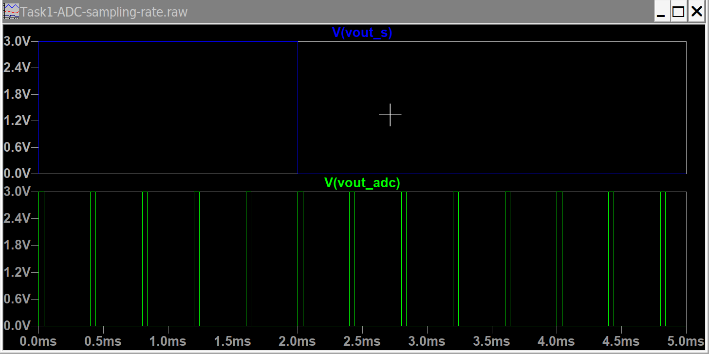
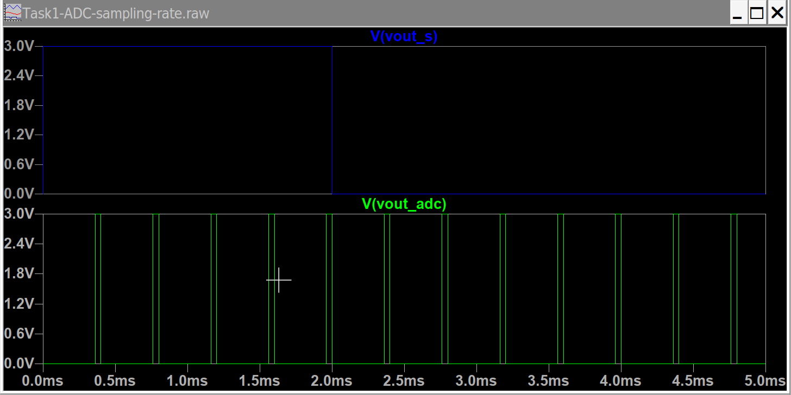
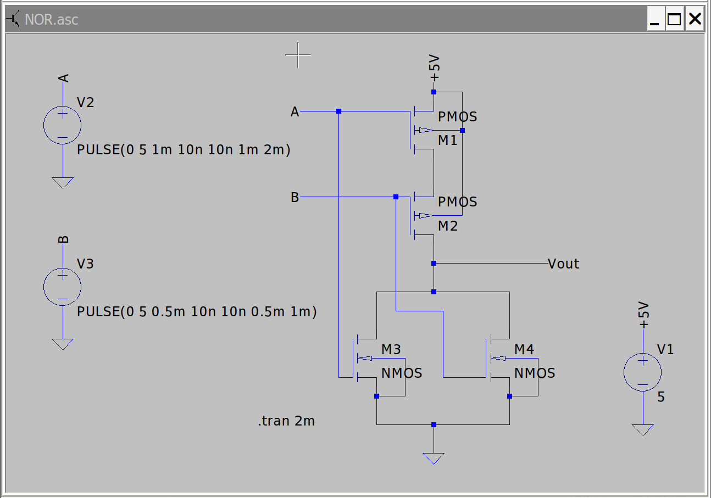
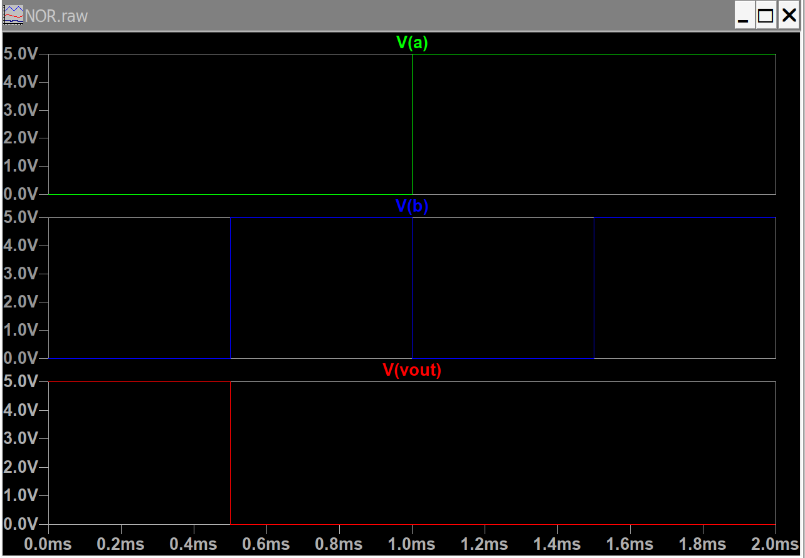

# Заняття 5: Цифрова схемотехніка. Симуляції схем.

### Завдання 1 — частота дискретизації АЦП

Датчик у нормальному стані формує напругу 0 В. При виникненні події він формує прямокутний імпульс напругою 3 В тривалістю 2 мс. Такий імпульс виникає приблизно один раз на секунду, але момент його появи наперед невідомий. Мікроконтролер безперервно зчитує сигнал за допомогою АЦП.

Розрахуйте частоту дискретизації, щоб АЦП гарантовано виконав 5 вимірювань протягом імпульсу.

Рішення: Ось графік, на якому зображено імпульс датчику Vout_s, довжиною в Tsensor = 2 мс і додатковий графік у вигляді імпульсів, що показує частоту зчитування сигналу за допомогою АЦП (кожен імпульс — це одне зчитування). На даному графіку зчитування починається разом з початком імпульсу датчика:

При даних умовах ми гарантовано повинні зчитати гарантовано 5 вимірювань (починаючи з початку імпульсу сигналу). В даному випадку в імпульс попадають 5 проміжків між подіями зчитування сигналу і можемо читати 5 разів якщо перше зчитування починається з початком самого імпульсу.

Якщо ж сигнал зміщується, то мінімальна кількість подій зчитування дорівнює 5:

Останній момент, коли може відбутися зчитування це коли процес зчитування завершується саме тоді, коли завершується імпульс датчика:

Відповідно для того, щоб умови задачі виконувалися потрібно так підібрати частоту, щоб кількість періодів зчитування була \> 5.

**Узагальнений розрахунок** (якщо не враховувати час, необхідний для перетворення аналогового сигнала в цифровий):

Розраховуємо період зчитування: Tadc_read \<= Tsensor / 5 = 2 ms / 5 = 0.4 ms.

Частота зчитування Fread відповідно буде \>= 1 / Tadc_read = 1 / 0.4 ms = 1 / 0.0004 = 2500 Гц.

**Узагальнена відповідь:**

Для гарантованого отримання щонайменше 5 вимірювань під час імпульсу тривалістю 2 мс період дискретизації повинен бути не більшим за 0.4 мс. Відповідно, частота дискретизації АЦП повинна \>= 2.5 кГц. На практиці доцільно вибрати частоту дещо вищу за 2.5 кГц, наприклад 3 кГц або більше.

**Точний розрахунок** (якщо враховувати час, необхідний для перетворення аналогового сигналу в цифровий):

Час, необхідний для перетворення Tconvert.

Тоді період зчитування: Tadc_read \<= (Tsensor — Tconvert) / 5.

Частота зчитування Fread відповідно буде \>= 1 / Tadc_read.

Порівняльна таблиця характеристик АЦП:

| АЦП / Платформа | Мінімальний час одного вимірювання | Максимальна швидкість (SPS) | Розрядність (по бітах) | Особливості швидкісного режиму |
|----|----|----|----|----|
| **STM32** (вбудований) | **від 0,18 до 1 мкс** | 1 000 000 – 5 330 000 SPS | 12 біт (типово) | Потрібно використовувати **DMA** та тактування від таймера. |
| **ESP32** (вбудований) | **від 5 до 10 мкс** | до 100 000 – 200 000 SPS | 12 біт | Надвисока швидкість (до 2 MSPS теорія) доступна тільки через **I2S/DMA при вимкненому Wi-Fi**. |
| **ADS1115** (зовнішній) | **1,16 мс** (1160 мкс) | до 860 SPS | **16 біт** | Обмежений швидкістю шини **I2C** та архітектурою Delta-Sigma. |

Де SPS - Samples Per Second - Вибірок за секунду.

**Точна відповідь для STM32:**

Час, необхідний для перетворення Tconvert = 1 мкс.

Тоді період зчитування: Tadc_read \<= (Tsensor — Tconvert) / 5 = (2 мс — 1 мкс) / 5 = (0.002 - 0.000001) / 5 = 0.0003998 с.

Частота зчитування відповідно буде \>= 1 / Tadc_read = 1 / 0.0003998 с ≈ 2501.25 Гц.

Приводимо частоту до найближчої більшої, отримуємо **Fread \>= 2502 Гц**.

**Точна відповідь для ESP32:**

Час, необхідний для перетворення Tconvert = 10 мкс.

Тоді період зчитування: Tadc_read \<= (Tsensor — Tconvert) / 5 = (2 мс — 10 мкс) / 5 = (0.002 - 0.00001) / 5 = 0.000398 с.

Частота зчитування відповідно буде \>= 1 / Tadc_read = 1 / 0.000398 с ≈ 2512.56 Гц.

Приводимо частоту до найближчої більшої, отримуємо **Fread \>= 2513 Гц**.

**Точна відповідь для ADS1115:**

Час, необхідний для перетворення Tconvert = 1.16 мкс.

Тоді період зчитування: Tadc_read \<= (Tsensor — Tconvert) / 5 = (2 мс — 1.16 мкс) / 5 = (0.002 - 0.00000116) / 5 = 0.000399768 с.

Частота зчитування відповідно буде \>= 1 / Tadc_read = 1 / 0.000399768 с ≈ 2501.45 Гц.

Приводимо частоту до найближчої більшої, отримуємо **Fread \>= 2502 Гц**.

### Завдання 2 — код ЦАП (DAC)

Є 8-бітний цифро-аналоговий перетворювач (DAC). Максимальна вихідна напруга DAC становить 3,0 В. Необхідно сформувати на виході напругу 1,3 В.

Розрахуйте цифровий код, який потрібно записати в регістр DAC, та фактичну напругу на виході.

8 біт — це байт, тобто 256 значень. Але значення 0 не приймає участь у формуванні вихідної напруги, тому реальних значень буде 255. В цьому випадку якщо в регістр записуємо значення 0 (0x00), то отримуємо 0.0 В. Якщо записуємо число 255 (0xFF), то отримуємо максимальну вихідну напругу 3.0 В.

Ділимо максимальну вихідну напругу на 255, отримуємо Vdiscr = 0.011764706 В на один крок дискретизації.

Я перевірив для кожного значення регістру і розрахував вихідну напругу:

| Register value | Vout, V |
|--------------------|-------------|
| 0                  | 0.00000000  |
| 1                  | 0.01176471  |
| 2                  | 0.02352941  |
| 3                  | 0.03529412  |
| …                  | …           |
| 253                | 2.97647062  |
| 254                | 2.98823532  |
| 255                | 3.00000003  |

Для того, щоб розрахувати значення яке потрібно записати в регістр, потрібно його поділити на значення кроку дискредитації: Rnum1.3 = 1.3 В / Vdiscr = 1.3 В / 0.011764706 В = 110.499998895. Так як це має бути ціле число, то ми повинні округлити його до найближчого цілого.

Vout110 = 110 \* 0.011764706 В = 1.29411766 В.

Отримуємо різницю по модулю Vdelta110 = \|1.3 В - 1.29411766 В\| = 0.00588234 В.

Vout111 = 111 \* 0.011764706 В = 1.305882366 В.

Отримуємо різницю по модулю Vdelta111 = \|1.3 В - 1.305882366 В\| = 0.005882366 В.

Дивимося на найближчі значення:

| Register value | Vout, V | Vdelta  |
|--------------------|-------------|-------------|
| 110                | 1.29411766  | 0.005882340 |
| 111                | 1.30588237  | 0.005882366 |

В даному випадку більш точне значення напруги 1.3 В відповідає значенню регістра 110.

Відповідь: Для того щоб на виході з 8-бітного цифро-аналогового перетворювача (DAC) сформувати на виході напругу 1,3 В потрібно в регістр перетворювача записати значення 110 (0x6E).

Фактична напруга буде в цьому випадку дорівнювати 1.29411766 В.

### Завдання 3 — побудова NOR елемента

Побудуйте NOR елемент, використовуючи базові логічні елементи (схему для побудови знайдете в презентації лекції).

Побудова схеми:

Запуск симуляції:

Як видно на графіку всі логічні сигнали в певний час відповідають логіці оператора NOR:

|          |       |       |          |
|:--------:|:-----:|:-----:|:--------:|
| **Time** | **A** | **B** | **Vout** |
|  0.2 c   |   0   |   0   |    1     |
|  0.8 c   |   0   |   1   |    0     |
|  1.2 c   |   1   |   0   |    0     |
|  1.8 c   |   1   |   1   |    0     |
