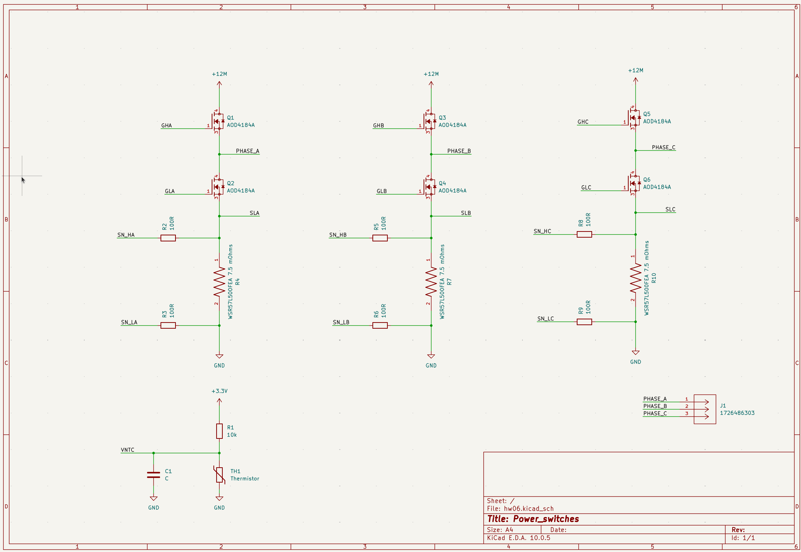
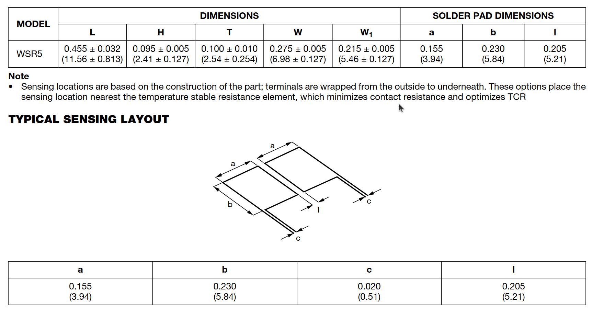
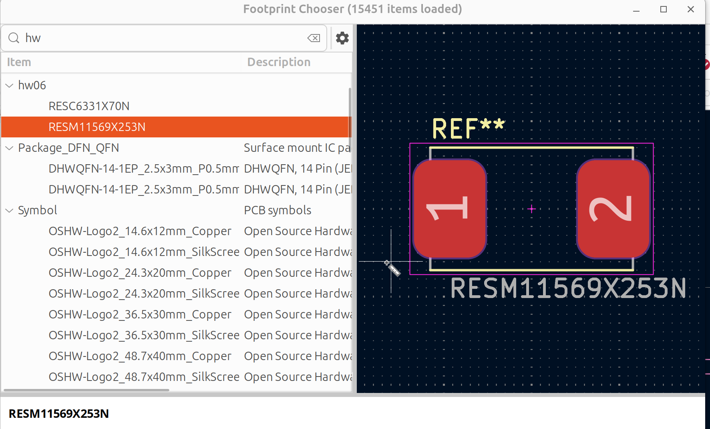
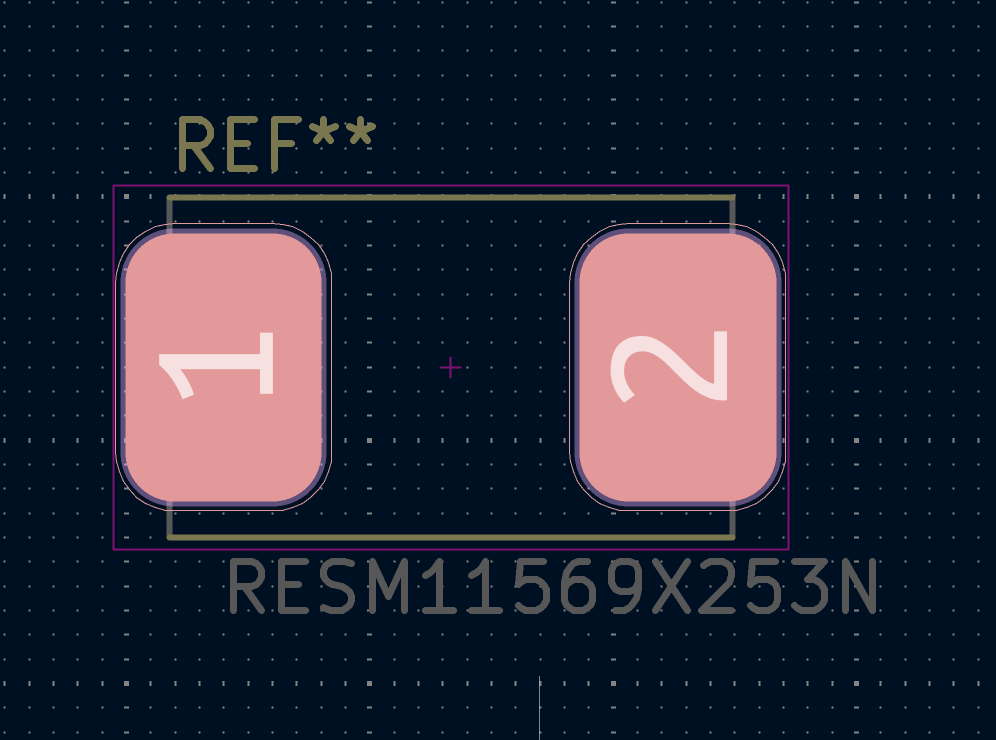
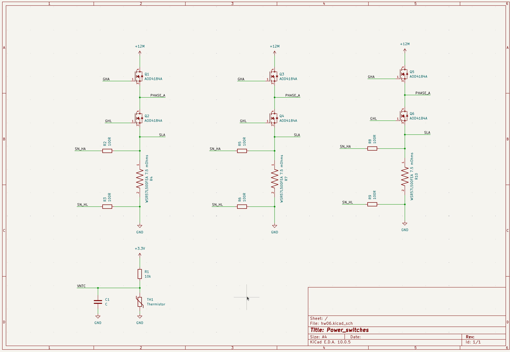

# Заняття 6: Інтерфейс KiCad та створення проєкту.

### Завдання 1 — підбір силових ключів та шунтів

Є приклад трифазної мостової схеми керування (три напівмости) двигуном ([у папці з додатковими ресурсами](https://drive.google.com/drive/folders/1CCpVQM1FImKKAaBql2j669Kx7Z-wt8mC?usp=sharing)). Потужність двигуна з навантаженням при напрузі 12В: 168Вт (~14А).

**Розрахувати:**

- Підібрати силові ключі для трьох напівмостів керування двигуном:

- запас по струму — мінімум 1.5–2 рази від розрахункового значення, з урахуванням температурних змін (дератинг Id при робочій температурі кристала/корпуса);

- запас по напрузі — мінімум 1.5–2 рази, комфортний запас — x3.

- Підібрати шунти для виміру струму в обмотках (коефіцієнт підсилення підсилювача — 20 В/В):

- номінал шунта розрахувати з запасом на 50% понад очікуваний піковий струм;

- 3.3В — максимальна напруга вимірювального сигналу на виході підсилювача

**Підібрати ключі:**

Виявляється (для мене :) що одночасно струм через трифазний двигун, що керується ключами MOSFET, поступає тільки через одну пару фаз — AB, BC, CA (на відміну від трьохфазного двигуна змінного струму AC), і струм проходить максимальний для постійного джерела живлення — Imax = 168 Вт / 12 А = 14 А.

Добре. Тоді закладемо запас, що вказаний в умовах задачі - запас по струму — мінімум 1.5–2 рази від розрахункового значення.

Для запасу в 1.5 рази відповідний струм буде Imax 1.5 = 14 А \* 1.5 = 21 А.

Для запасу в 2 рази відповідний струм буде Imax 2 = 14 А \* 2 = 28 А.

Закладемо запас по напрузі - запас по напрузі — мінімум 1.5–2 рази, комфортний запас — x3.

Для запасу в 1.5 рази Umax = 12 В \* 1.5 = 18 В.

Для запасу в 2 рази Umax = 12 В \* 2 = 24 В.

Для комфортного запасу в 3 рази Umax = 12 В \* 3 = 36 В.

В нашому випадку для підбору ключів нам потрібен ключ у якого максимальні значення більші або дорівнюють розрахованим величинам:

Imax = {21, 28} А, Umax = {18, 24, 36} В.

N-Channel [MOSFETs](https://octopart.com/search?autosugg_idx=test&currency=UAH&specs=0&full_query=category%3AMOSFETs+drain-to-source-voltage-vdss%3E%3D%2230+V%22+&s=1&inferred_category_id=4228&inference=1&search_category_id=4229&search_draintosourcevoltage_vdss_=(30__))

| MOSFET | VDS | ID A |  | RDS(on) | Qg | VGS | Корпус | Примітка |
|----|:--:|:--:|:--:|:--:|:--:|:--:|:--:|:--:|
|  |  | 25 °C | 100 °C |  |  |  |  |  |
| [IRLR3714](https://octopart.com/datasheet/infineon/IRLR3714) | 20 | 36 | 31 (70 °C) | 0.02 | 6.5 | 10 V | D-Pak / I-Pak |  |
| [IRFR3704](https://octopart.com/datasheet/infineon/IRFR3704) | 20 | 75 | 63 (70 °C) | 0.0095 | 19 | 10 V | D-Pak / I-Pak |  |
| [IPD060N03LGATMA1](https://octopart.com/datasheet/infineon/IPD060N03LGATMA1) | 30 | 50 | 50 | 0.006 | 10.8 | 10 V | PG-TO251-3 |  |
| [FQP30N06L](https://octopart.com/datasheet/onsemi/FQP30N06L) | 60 | 32 | 22.6 | 0.035 | 15 | 10 V | TO-220 |  |
| [IRFZ34NPBF](https://octopart.com/datasheet/infineon/IRFZ34NPBF) | 55 | 29 | 20 | 0.040 | 34 | 10 V | TO-220AB |  |
| [STD30NF04LT](https://octopart.com/datasheet/stmicroelectronics/STD30NF04LT) | 40 | 30 | 21 | 0.03 | 17 | 10 V | DPAK |  |
| [IRL3705NPBF](https://octopart.com/datasheet/infineon/IRL3705NPBF) | 55 | 89 | 63 | 0.010 | 98 | 10 V | TO-220AB |  |
| [IRLR2703](https://octopart.com/datasheet/international-rectifier/IRLR2703) | 30 | 23 | 16 | 0.045 | 15 | 10 V | D-Pak / I-Pak |  |
| [IPD050N03L](https://octopart.com/datasheet/infineon/IPD050N03LGATMA1) | 30 | 50 | 50 | 0.005 | 15 | 10 V | PG-TO252-3-11 |  |
| [SUD50N03-06AP-E3](https://octopart.com/datasheet/vishay/SUD50N03-06AP-E3) | 30 | 30 | 25 (70 °C) | 0.0046 | 30 | 10 V | TO-252 |  |
| [AOD4184A](https://octopart.com/datasheet/alpha-omega-semiconductor/AOD4184A) | 40 | 50 | 40 | 0.0058 | 27 | 10 V | TO-252 |  |
| [IRFR3303PBF](https://octopart.com/datasheet/infineon/IRFR3303PBF) | 30 | 33 | 21 | 0.031 | 29 | 10 V | D-Pak / I-Pak |  |
| [IPD06N03LAG](https://octopart.com/datasheet/infineon/IPD06N03LAG) | 25 | 50 | 50 | 0.0057 | 17 | 10 V | P-TO252-3-11 |  |
| [STP60NF06](https://octopart.com/datasheet/stmicroelectronics/STP60NF06) | 60 | 60 | 42 | 0.014 | 54 | 10 V | TO-220 |  |
| [IRLZ44NPBF](https://octopart.com/datasheet/infineon/IRLZ44NPBF) | 55 | 47 | 33 | 0.022 | RV | 10 V | TO-220AB |  |

Таблиця кандидатів у відбір кращих силових ключів

<table>
<colgroup>
<col style="width: 15%" />
<col style="width: 28%" />
<col style="width: 26%" />
<col style="width: 28%" />
</colgroup>
<thead>
<tr>
<th style="text-align: center;">ID \ VDS</th>
<th style="text-align: center;">≥18 V</th>
<th style="text-align: center;">≥24 V</th>
<th style="text-align: center;">≥36 V</th>
</tr>
</thead>
<tbody>
<tr>
<td style="text-align: center;"><strong>≥21 A</strong></td>
<td style="text-align: center;">---</td>
<td>1. IRLR2703 (30V, 23A)</td>
<td style="text-align: center;">---</td>
</tr>
<tr>
<td style="text-align: center;"><strong>≥28 A</strong></td>
<td style="text-align: center;">
1. IRLR3714 (20V, 36A)

2. IRFR3704 (20V, 75A)
</td>
<td>
1. IPD060N03L (30V, 50A)

2. IPD050N03L (30V, 50A)

3. SUD50N03 (30V, 30A)

4. IRFR3303PBF (30V, 33A)

5. IPD06N03LAG (25V, 50A)
</td>
<td style="text-align: center;">
1. FQP30N06L (60V, 32A)

2. IRFZ34NPBF (55V, 29A)

3. STD30NF04LT (40V, 30A)

4. IRL3705NPBF (55V, 89A)

5. AOD4184A (40V, 50A)

6. STP60NF06 (60V, 60A)

7. IRLZ44NPBF (55V, 47A)
</td>
</tr>
</tbody>
</table>

Вибираємо по максимальній напрузі та струму (≥28 A та ≥36 V) — права нижня комірка:

Найкращим вибором є AOD4184A (RDS(on) = 0.0058 Ом) або IRL3705NPBF (має великий запас за струмом 89A та низький опір 0.010 Ом).

**Мій вибір:**

З двох кандидатів вибираю AOD4184A. Безперервний струм стоку при 25 °C ID = 50A. Крім того він гарно тримається при нагріванні до 100 °C (ID = 40A).

Це також ключ з низьким опором відкритого каналу RDS(on) = 0.0058 Ом. Чим менше опору, тим менше втрат потужності на нагрівання.

Формула для розрахунку втрати потужності: P = I2 x RDS(on).

Подивимося на різницю в нагріванні при струмі двигуна, наприклад, 25 А.

Наприклад,

- Для IRL3705NPBF: RDS(on) = 0.010 Ом. --\> P = 252 x 0.010 = 6.25 Вт

- Для AOD4184A: RDS(on) = 0.0058 Ом. --\> P = 252 x 0.0058 = 3.625 Вт

Тобто при одному і тому ж струмі на ключі AOD4184A виділяється майже в 2 рази менше ніж на IRL3705NPBF.

Крім того це транзистор в SMD-корпусі (TO-252).

Згідно datasheet, у нього вказаний параметр Power Dissipation A (це використання в реальних умовах без радіатора — на платі достатньо наявності квадратної площадки в 1 квадратний дюйм 25.4 x 25.4 мм = 6.45 см2):

- При TA = 25 °C --\> PDSM = 2.3 Вт.

- При TA = 100 °C --\> PDSM = 1.5 Вт.

При струмі в 14 А розраховуємо потужність розсіювання, Вт:

- P = 142 x 0.0058 = 1.1368 Вт ≈ 1.15 Вт.

**Висновок:**

Ключ AOD4184A у SMD корпусі при наявності на платі мідної площадки площою в 6.45 см2, навіть при нагріві навколишнього середовища до температури 100 °C цей ключ зможе розсіювати потужність в 1.15 Вт (1.15 Вт \< 1.5 Вт) без будь-яких зовнішніх алюмінієвих радіаторів з запасом майже в 1.5 рази. Тоді як при кімнатній температурі цей показник виявляється ще більше комфортним (1.15 Вт \< 2.3 Вт) — в 2 рази менший.

**Порахуємо шунти:**

Нам відомі наступні первинні умови:

- Коефіцієнт підсилення підсилювача ACL = 20 В/В;

- Номінал шунта розрахувати з запасом на 50% (SF = 1.5) понад очікуваний піковий струм;

- Максимальна напруга вимірювального сигналу на виході підсилювача:

  Uout max = 3.3 В;

Підемо з кінця — найбільше наше обмеження — це максимальна напруга на виході підсилювача, яку нам не можна перевищувати.

Розраховуємо максимальну напругу на вході підсилювача:

Uin max = Uout max / ACL = 3.3 В / 20 = 0.165 В.

І відповідно максимальна напруга на шунті повинна дорівнювати максимальній вхідній напрузі:

Ush max = Uin max = 0.165 В

Розраховуємо з запасом максимальний піковий струм що проходить через шунт Ish max = Imax \* SF (Safety Factor) = 14 А \* 1.5 = 21 А

В нас є максимальна напруга на шунті, є максимальний струм. Тепер розрахуємо максимальний опір шунта:

Rsh = Ush max / Ish max = 0.165 В / 21 А = 0.007857143 Ом ≈ 7.5 мОм (шукаємо по таблиці найближчий менший опір, тому що більший збільшить нашу максимальну напругу на вході підсилювача).

Так як всі ці три напівмости для керування двигуном однакові, то відповідь буде наступною:

**Розрахований опір шунта** Rsh = 7.5 мОм.

Перевірка:

Шунт Rsh = 7.5 мОм, піковий струм на ньому Ish = 14 А \* 1.5 = 21 А. Тоді максимальна напруга на шунті Ush = Rsh \* Ish = 7.5 мОм \* 21 А = 0.1575 В.

На виході підсилювача ми отримаємо Uout = Ush \* ACL = 0.1575 В \* 20 = 3.15 В.

Це менше ніж максимальна допустима напруга на виході з підсилювача:

3.15 В \< 3.3 В

При цьому чистий запас АЦП = (3.3 В - 3.15 В)/ 3.3 В \* 100% ≈ 4.5%, що впевнено захищає від насичення через наявність безпечного проміжка по напрузі:

3.3 В - 3.15 В = 0.15 В.

**Підбір footprint для шунта:**

Розрахуємо потужність нашого шунта: Psh = Ush max \* Ish max = 0.165 В \* 21 А = 3.465 Вт. Потрібно вибирати найближче більше стандартне значення потіжності = 5 Вт

Вибираю для шунта наступний SMD резистор: [WSR57L500FEA](https://www.vishay.com/docs/31059/wsrhighpower.pdf) з такими параметрами:

- Resistance: 7.5 mOhms

- Power Rating: 5 W

- Manufacturer: Vishay

Для нього вказано наступний footprint (який чомусь відсутній в KiCad):

- GLOBAL MODEL: WSR5

- SIZE: 4527

Корпус 4527 J-Lead має дюймові розміри приблизно 0.45 x 0.27 дюйма (11.56 × 6.98 мм). Це 2 контактних площадки розміром 3.94 мм x 5.84 мм, між якими відстань 5.12 мм.

Знайшов корпус по назві WSR57L500FEA на [сайті https://www.snapeda.com](https://www.snapeda.com/parts/WSR57L500FEA/Vishay/view-part/?ref=search&t=WSR57L500FEA&ab_test_case=b).

Імпортував в свою бібліотеку KiCad:

На платі в KiCad:

### Завдання 2 — схема силової частини

Створіть схему силової частини.

