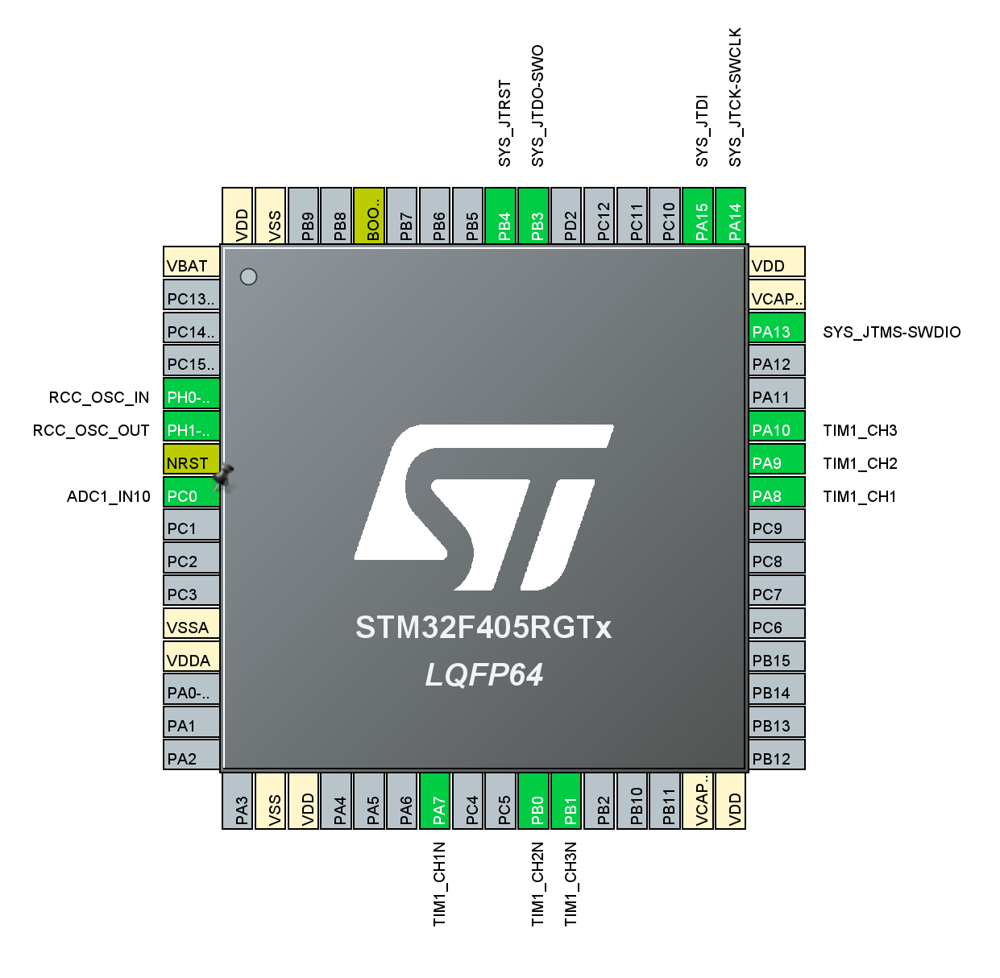
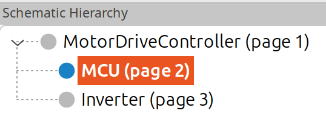
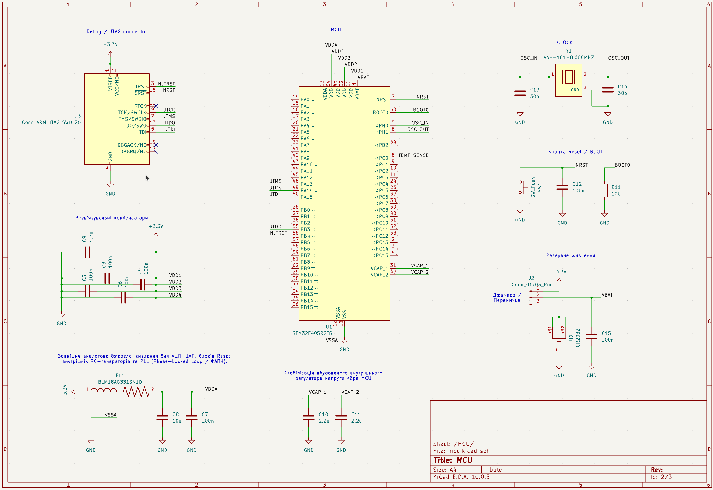

# Заняття 7: Архітектура MCU та системи живлення.

### Завдання 1

Опис завдання: в STM32CubeM сконфігурувати піни контролера STM32F405RGT (базовий варіант):

- TIM1 (CH1 CH1N)

- TIM1 (CH2 CH2N)

- TIM1 (CH3 CH3N)

- піни кварцового резонатора (RCC/HSE)

- входи програматора (SYS-JTAG)

- ADC (вхід для заміру показників термістора зі схеми 6 заняття)

Можна обрати інший мікроконтролер, якщо він має:

- за бажанням три ADC-периферії. Три окремих ADC забезпечить одночасний замір, а значить точніше керування на високих частотах обертання двигуна;

- advanced-control timer із можливістю формування комплементарного PWM для трьох каналів;

- підтримку dead time.

Вкажіть модель обраного мікроконтролера та прикріпіть скріншот Pinout view.

### Завдання 2

Опис завдання: на окремому аркуші створіть схему мінімального підключення обраного мікроконтролера STM32Fxxx. Покажіть необхідні для роботи підключення відповідно до матеріалів слайдів 19–23: живлення та decoupling, VDDA/VSSA, NRST, BOOT, VBAT/backup domain, тактовий генератор тощо.

Вибираю кварц: AAH-181-8.000MHZ. Параметри з [datasheet](https://www.snapeda.com/parts/AAH-181-8.000MHZ/ABRACON/datasheet/) наступні:

Load capacitance (CL): 18.0 pF

CL = C1 x C2 / (C1 + C2) + Cs,

де Cs (Stray capacitance) - паразитна ємність плати Cs = 3 pF (2–5 pF)

Якщо C1 = C2 = Cext то:

CL = Cext / 2 + Cs --\> Cext / 2 = CL - Cs --\>

Cext = 2x(CL - Cs) = 2x(18.0 pF - 3 pF) = 30 pF

Додано ієрархічну структуру креслень де MCU — це поточна схема, Inverter — це схема силових ключів:

Електрична схема підключення MCU STM32F405RGT6:

