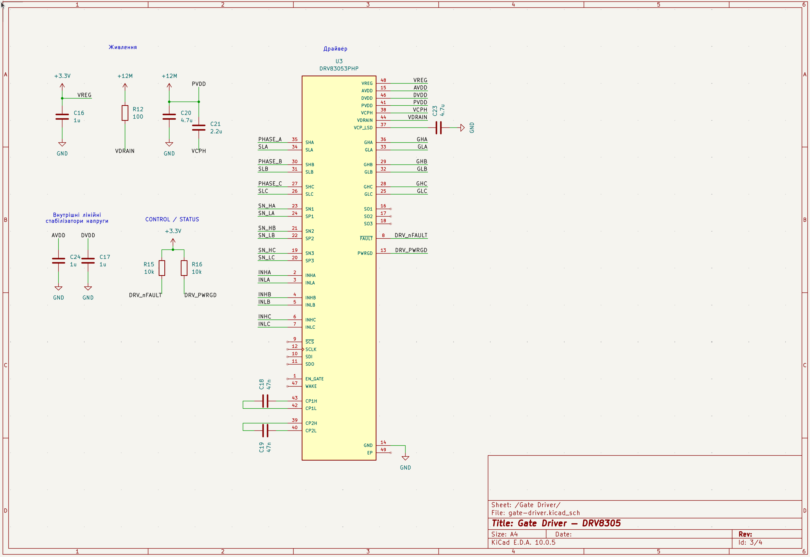
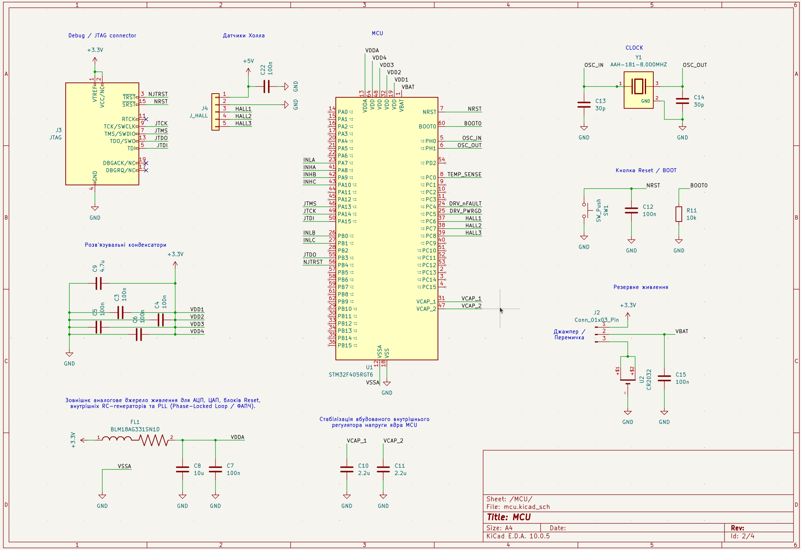
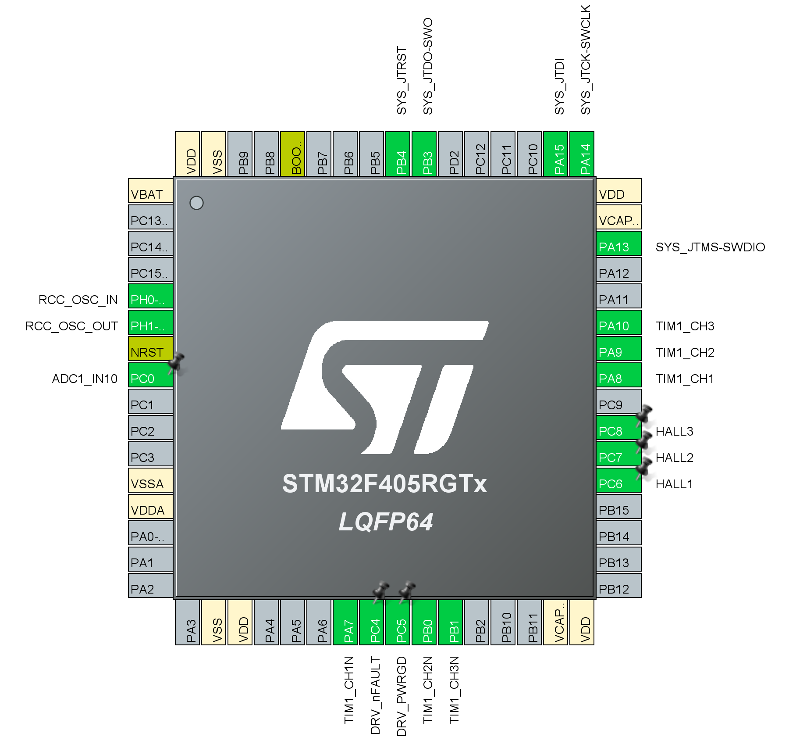
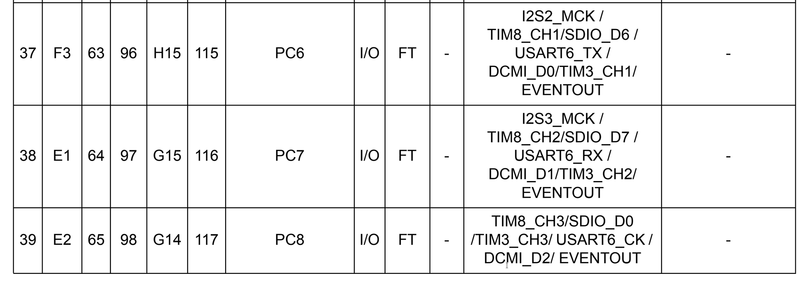

# Заняття 8: Електричні двигуни. Принципи роботи і керування.

## Опис завдання
Імпортувати компонент DRV8305 та створити схему його підключення відповідно до даташиту.

1\. Імпортуйте компонент **DRV8305**.

2\. Створіть схему підключення відповідно до даташиту. Даташит можна знайти [в папці з додатковими ресурсами](https://drive.google.com/drive/folders/10yhwZ3x6XxErtohCtULcZ-SOZ1yHaNlk?usp=drive_link).

- Необхідні зовнішні конденсатори та резистори вказані в таблиці **External Components** (ст. 5).

- Припустіть, що драйвер живиться напругою **+3V3**.

- На вхід **VDRAIN** подайте напругу живлення двигуна **+12_M**.

3\. У проєкті **STM32CubeMX** визначте виходи advanced timer, налаштовані як **PWM Generation CH1..3 та CH1..3N**. Позначте відповідні сигнали на схемі MCU та схемі DRV8305 (**INHA…INLC**).

4\. Додайте на схему сигнали **PWRGD** та **nFAULT**. У проєкті STM32CubeMX визначте їх як входи.

- Оскільки ці сигнали є **open-drain**, вони потребують підтягувальних резисторів.

- Рекомендовані номінали резисторів наведені в таблиці **Pin Functions** даташиту.

5\. Присвойте нетам локальні мітки (**labels**) для зручності роботи зі схемою.

6\. У даташиті на **STM32F7** (додаткові ресурси до заняття 7, файл **DM00037051.pdf**, с. 48–61) визначте піни з підтримкою **FT (5 V tolerant I/O)** та підключіть до них на схемі MCU датчики Холла **HALL1**, **HALL2**, **HALL3**.

## Рішення завдання

1\. Імпортуємо компонент **DRV8305**.

1\.1\. В пошуку на [сайті](https://www.snapeda.com/search/?q=DRV8305&search-type=parts)
я знайшов наступні компоненти Texas Instruments:

**45-V max 3-phase smart gate driver with current shunt amplifiers & SPI**:
- DRV83053PHPR
- DRV83053PHP
- DRV83055PHP
- DRV83055PHPR
- DRV8305NPHP
- DRV8305NPHPR

**Automotive 12-V battery 3-phase smart gate driver (grade 0 & grade 1)**:
- DRV83053QPHPRQ1
- DRV83055QPHPRQ1
- DRV8305NEPHPRQ1
- DRV83055QPHPQ1
- DRV8305NQPHPQ1
- DRV83053QPHPQ1
- DRV8305NEPHPQ1
- DRV8305NQPHPRQ1

**Automotive 3-Phase Motor Gate Driver Evaluation Module**:
- DRV8305-Q1EVM

**EVAL BOARD, DRV8305 DC MOTOR DRIVER**;
Application Sub Type:DC Brushless Motor;
Silicon Manufacturer:Texas Instruments;
Kit Application Type:Power Management - Motor Control;
Silicon Core Number:DRV8305;
Kit Contents:Eval Board DRV8305;
Product Range:-;
SVHC:No SVHC (27-Jun-2018);
Features:3-PH Brushless DC Motor Driver, 15A Continuous/20A Peak O/P Current,
Thermal Protection, 4.4V-45Vin:
- BOOSTXLDRV8305EVM

1\.2\. Вибір компонента:

- Крок 1: Нам потрібна мікросхема.

Все що закінчується на **EVM** нам не подходить - це компактна плата розширення.

- Крок 2: Автомобільний чи промисловий стандарт?

Все що із суфіксом -**Q1** або літерою **Q** - це автомобільний (Automotive) стандарт.
Вони сертифіковані за стандартом AEC-Q100 (Grade 0 або 1), витримують сильні вібрації
та екстремальні температури (від -40°C до +150°C) для роботи в реальних автомобілях
від 12-вольтового акумулятора. Скоріш за все вони більш дорогі і нам теж не підходять,
тому вибираємо без позначок **Q** та **Q1**. Нам потрібен звичайний промисловий стандарт.

- Крок 3: Яка напруга потрібна для живлення мікроконтролера?

Символ що вказаний на місці знака # **DRV8305#** означає живлення: **3** - драйвер має
вбудований стабілізатор на **3.3 В**, **5** - має стабілізатор на **5.0 В**, **N** -
стабілізатор вимкнено (обирається якщо на платі вже є потужне джерело живлення,
і від драйвера потрібні тільки функції керування мотором).

В нас вже є MCU що споживає 3.3 В живлення, тому нам підходить з цифрою **3**:

**45-V max 3-phase smart gate driver with current shunt amplifiers & SPI**: DRV83053PHPR, DRV83053PHP

- Крок 4: Як плата буде збиратися на заводі (Пакування)?

Останні літери відповідають за форму випуску для виробництва. Корпус у всіх однаковий
- **HTQFP-48** (**PHP**). Але якщо без літери **R** (наприклад, **DRV83053PHP**), то це
означає що мікросхема постачається у пластикових лотках (**Trays**). Зручно для ручної
пайки або дрібних партій. З літорою **R** наприкінці (наприклад, **DRV83053PHPR**), то
постачається в рулонах / стрічці (**Tape & Reel**). Обирається для масового серійного
виробництва, де робот-розкладач автоматично бере чипи зі стрічки. Нам підходить без літери **R**.

- Крок 5: Мій вибір **DRV83053PHP**:

**Я обираю промислову версію DRV83053PHP, тому що мій пристрій не автомобільний, мій мікроконтролер потребує живлення 3.3 В, а корпус PHP (HTQFP-48) зручний для розведення плати і ручної пайки.**

1\.2\. Скачую її символічне значення та місце для розташування:

Завантажую компонент з сайту [SnapEDA](https://www.snapeda.com/parts/DRV83053PHP/Texas%20Instruments/view-part/?ref=search&t=DRV8305&ab_test_case=b):

- Переміщую в папку parts:
`motor-drive-controller/hardware/kicad/lib/parts/DRV83053PHP/`:

```
lib/parts/DRV83053PHP/
├── DRV83053PHP.kicad_sym
├── QFP50P900X900X120-49N.kicad_mod
└── DRV83053PHP.step
```

- Імпортую в KiCad → *Preferences → Manage Symbol/Footprint Libraries → Project Specific Libraries*:

2\. Створіть схему підключення відповідно до даташиту. Даташит можна знайти [в папці з додатковими ресурсами](https://drive.google.com/drive/folders/10yhwZ3x6XxErtohCtULcZ-SOZ1yHaNlk?usp=drive_link).

- Необхідні зовнішні конденсатори та резистори вказані в таблиці **External Components** (ст. 5).

- Припустіть, що драйвер живиться напругою **+3V3**.

- На вхід **VDRAIN** подайте напругу живлення двигуна **+12_M**.

## Результат

1\. **Драйвер**.



2\. **MCU**.



3\. **MCU Pinout View**.



4\. **MCU піни з підтримкою FT**.


