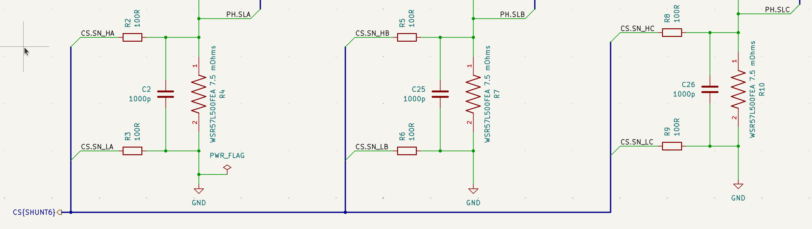
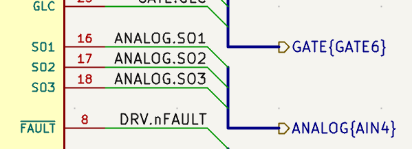
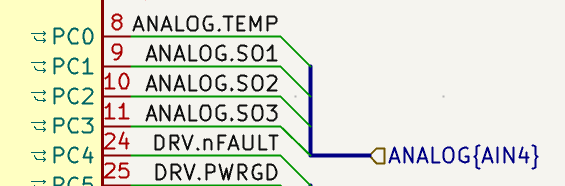
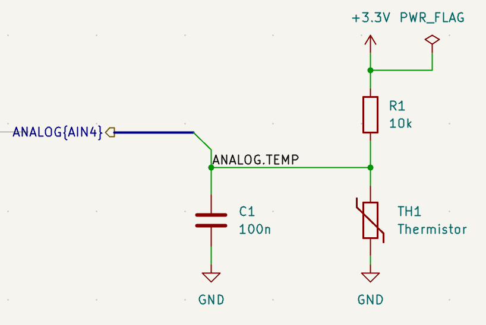
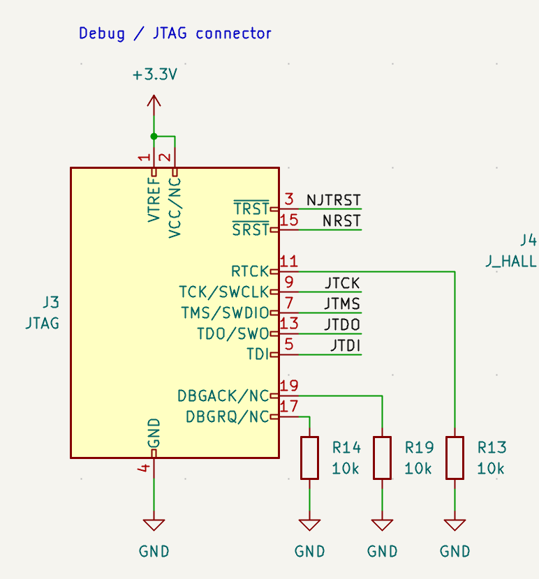
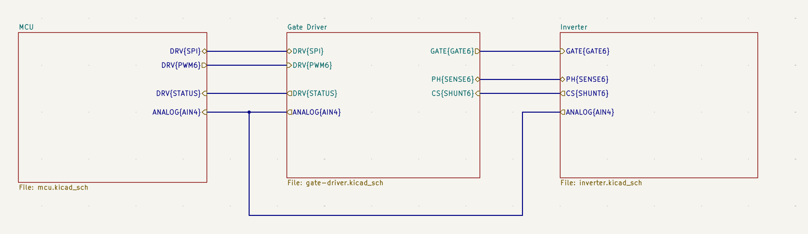
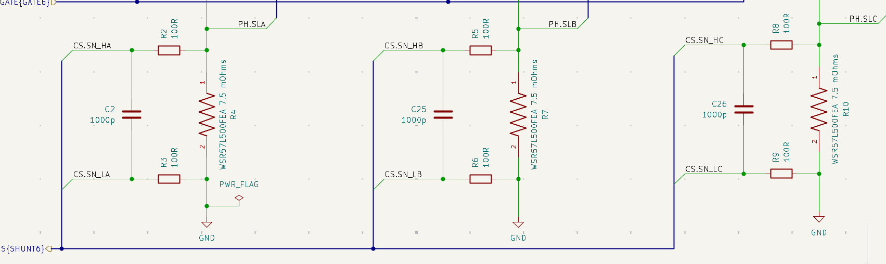

# Заняття 9: Проєктування "minimal system board"    .

## Опис завдання
У проєкті STM32CubeMX додати комунікаційні інтерфейси драйвера DRV8305 та завершити схему зворотного зв'язку по струму двигуна.

1\. У проєкті STM32CubeMX визначте SPI.

2\. Додайте на схему SPI-з'єднання між MCU і DRV8305.

3\. Заведіть сигнали з шунтів на відповідні входи драйвера відповідно до схеми включення на [с. 16 даташита DRV8305](https://drive.google.com/file/d/15we6Waadlhgk92B2uwZrcYCdEMzbCQDo/view?usp=sharing).

4\. У проєкті STM32CubeMX визначте три входи ADC — **на трьох різних ADC-периферіях**, щоб забезпечити одночасний замір усіх трьох фаз.

- На ці входи заведіть виходи вбудованих операційних підсилювачів драйвера (замір струму котушок двигуна).

- Позначте відповідні сигнали на схемі MCU та на схемі DRV8305 (SO1, SO2, SO3).

## Необов'язкова частина (за бажанням, для тренування у використанні SMD-антен на платі):

1\. Імпортуйте компонент RN4871 (або використайте з бібліотеки KiCad).

2\. Створіть схему підключення RN4871 відповідно до даташита (référence-схема підключення — с. 27).

- Захист від переполюсовки можна не використовувати.

- Reset бажано завести на вхід MCU.

3\. У проєкті STM32CubeMX визначте UART. Додайте на схему UART-з'єднання між MCU і Bluetooth-модулем RN4871.

## Рішення завдання

1\. Включаю SPI.

В меню Connectivity --> SPI1 --> встановити значення Mode в Full-Duplex Master. Одразу з'явилися нові використані піни:

- PB5 - SPI1_MOSI

- PA6 - SPI1_MISO

- PA5 - SPI1_SCK

Цікаво: так як стандартний пін для SPI1_MOSI - PA7 вже був зайнятий TIM1_CH1N, то він автоматично перепризначив його на запасний варіант - PB5. Я тут очікував помилки, що потрібно буде все виправляти вручну.

- Pull-up резистор в 1.5 кОм на лінію SDO драйвера DRV8305 для роботи SPI

Лінія SDO драйвера DRV8305 підключається до піна PA6 STM32F405RGT6. Я вказав в параметрі GPIO Pull-up/Pull-down значення Pull-up, але знайшов [інформацію](https://e2e.ti.com/support/motor-drivers-group/motor-drivers/f/motor-drivers-forum/677844/drv8305-drv8305-spi-and-sdo) що стандартних Pull-up резисторів недостатньо. Згідно datasheet їх опір, параметр Rpu (Weak pull-up equivalent resistor), складає зазвичай від 30 до 50 кОм, що не є достатніми для повноцінної передачі інформації на максимальній швидкості і рекомендують встановити окремий pull-up резистор в 1.5 кОм. Додаю його на схему,
а параметр GPIO Pull-up/Pull-down встановлюю значення No pull-up and no pull-down.

- Додаю GPIO пін DRV_nSCS для вибора мікросхеми драйвера

Я не можу використовувати вбудований сигнал SPI1_NSS, бо в STM32F405xx в режимі master mode цей сигнал завжди у високому стані:

Крім того для нормального керування драйвером DRV8305 по шині SPI потрібно, щоб між кадрами nSCS тримався у високому рівні щонайменше 400 нс (tHI_SCS - SCS minimum high time before SCS active low; у тексті розділу 7.5.1 даташита вказано 500 нс, тому беремо з запасом 500 нс):

Додаю ручне керування вибора драйвера nSCS. Перевожу пін PA4 в режим GPIO_Output та перейменовую його в DRV_nSCS. З'єдную з nSCS драйвера DRV8305. При цьому значення властивості SPI --> Hardware NSS Signal залишаю у статусі Disabled.

- Контроль статусу DRV_nSCS (PA4) до та після ініціалізації

У властивостях піна PA4 STM32F405RGT6 встановлюємо в параметрі GPIO output level: High, щоб одразу після ініціалізації лінія була неактивною і не було короткого імпульсу в нуль. GPIO Pull-up/Pull-down залишаю як є - без Pull-up тому що внутрішній pull-up STM32 на виході нічого не дає, а на етапі до ініціалізації він не діє.

Цікаво що на інвертованому вході nSCS згідно datasheet на 7.2 Functional Block Diagram вказано що є пітяжка до землі а не до +3.3V!

Внутрішній pulldown драйвера має великий номінал 100 кОм (Rpd - Internal pulldown resistor), тож я додав би підтяжку до +3.3V з опором 10 кОм щоб надійно переважити його. Лінія буде у високому рівні з моменту подачі живлення до ініціалізації GPIO.

- Згідно з розділом 7.5.1 даташиту DRV8305 "If the data sent to SDI is less than or greater than 16 bits it is considered a frame error and the data will be
ignored." а в настройках у CubeMX SPI1 --> Parameter Settings --> Basic Parameters --> Data Size стоїть 8 біт. Міняємо на 16 біт.

- Частота SPI1. Також в настройках у CubeMX SPI --> Parameter Settings --> Clock Parameters --> Prescaler (for Baud Rate) стоїть значення 2.
Відповідно в SPI Baud Rate вказано 42 MBits/s. А згідно даташиту DRV8305 (6.6 SPI Timing Requirements (Slave Mode Only))
вказано значення tCLK (Minimum SPI clock period) = 100ns.
Тоді максимальна частота SPI1 Fmax = 1 / tCLK = 1 / 100ns = 1 / 0.0000001 = 10000000 = 10 МГц.
Тобто швидкість шини SPI Baud Rate вказано 42 MBits/s більше ніж максимальна частота 10 МГц.
Щоб знизити частоту вказуємо інше значення Prescaler = 16.
Тоді Baud Rate зменшився і дорівнює 5.25 MBits/s що менше максимальної частоти 10 МГц і знаходиться в потрібному діапазоні.

- Настройка сигнала CLK. Згідно діаграмі DRV8305 (6.6 SPI Timing Requirements (Slave Mode Only)) стан лінії тактування SCLK,
коли інтерфейс SPI перебуває в режимі очікування - це низький рівень. Тому в параметрі Clock Polarity (CPOL) виставляємо значення Low.

- Підтягуючий резистор для DRV8305 SCLK (6.5 Electrical Characteristics) - вже стоїть Rpd / Internal pulldown resistor / To GND = 100кОм.
Тому в настройках SPI1 --> Configuration --> GPIO Settings --> PA5 (SPI1_CLK) --> GPIO Pull-up/Pull-down
встановлюємо значення No pull-up and no pull-down.

- Момент зчитування даних - по спаду. Тому виставляємо значення Clock Phase (CPHA) --> 2 Edge

2\. Додав на схему SPI-з'єднання між MCU і DRV8305.

- Створив двонаправлену шину **DRV{SPI}** для MCU:

- Створив двонаправлену шину **DRV{SPI}** для драйвера:

3\. Підключаю сигнали з шунтів на відповідні входи драйвера відповідно до схеми включення.

- Створив шину **CS{SHUNT6}** для інвертора (додав до схеми - згідно схемі datasheet (Figure 18. Typical Application Schematic) паралельно шунту додаткові конденсатори емністю в 1000pF):

- Створив шину **CS{SHUNT6}** для драйвера:

4\. У проєкті STM32CubeMX визначаю три входи ADC — **на трьох різних ADC-периферіях**, щоб забезпечити одночасний замір усіх трьох фаз.

- Додаю нову шину для драйвера **ANALOG{AIN4}** де **AIN4** - це створений еліас елементів шини: {SO1 SO2 SO3 TEMP}:

- Вибираю піни для аналогово-цифрового перетворювача: PC1, PC2 і PC3 (поруч із уже зайнятим PC0 = TEMP). У даташиті STM32F405 вони позначені як ADC123_IN11, ADC123_IN12 і ADC123_IN13 — префікс **ADC123** означає, що канал заведений на всі три АЦП, тому кожен пін можна віддати окремій периферії:

| Пін | Сигнал | АЦП | Канал | Група |
|-----|--------|-----|-------|-------|
| PC0 | ANALOG.TEMP | ADC1 | IN10 | regular |
| PC1 | ANALOG.SO1 | ADC1 | IN11 | injected |
| PC2 | ANALOG.SO2 | ADC2 | IN12 | injected |
| PC3 | ANALOG.SO3 | ADC3 | IN13 | injected |

- Вмикаю одночасне вимірювання струмів трьох фаз: ADC1 --> Parameter Settings --> ADCs_Common_Settings --> Mode = Triple injected simultaneous mode only. У цьому режимі ADC1 (master) за одним тригером запускає injected-групи всіх трьох АЦП в один такт, ADC2 і ADC3 (slave) запускаються від нього.
Тому канали струмів ставлю саме в injected-групу (ADC_Injected_ConversionMode --> Number Of Conversions = 1, Rank 1 --> Channel = IN11/IN12/IN13 відповідно), а повільний TEMP лишається в regular-групі ADC1 (для двох каналів в ADC1 вмикаю Scan Conversion Mode).

- Тригер заміру. В ADC1 --> ADC_Injected_ConversionMode --> External Trigger Source = Timer 1 Trigger Out event, External Trigger Edge = rising edge. Щоб TIM1 генерував цю подію: TIM1 --> Parameter Settings --> Trigger Output (TRGO) Parameters --> Trigger Event Selection = Update Event. Так замір прив'язаний до періоду ШІМ (вибір точного моменту заміру всередині періоду — налаштування TIM1, яке робитиметься разом з прошивкою керування).

- Перейменовую їх у відповідні ANALOG.SO1, ANALOG.SO2, ANALOG.SO3 для MCU.

- Додаю нову шину для MCU **ANALOG{AIN4}**:

- Час вибірки (Sampling Time) — це час, протягом якого замкнений внутрішній ключ АЦП і заряджається його вимірювальний конденсатор. Він додається до часу самого перетворення: для Resolution = 12 bits це ще 12 тактів, тобто повний замір = Sampling Time + 12 тактів.
АЦП тактується від APB2 / 4 = 84 / 4 = 21 МГц. Значення за замовчуванням 3 такти (≈ 0.14 мкс) замале — конденсатор може не встигнути зарядитися до напруги входу. Виставляю для injected-каналів Sampling Time = 15 Cycles (≈ 0.71 мкс, повний замір 27 тактів ≈ 1.3 мкс) — однаково в ADC1, ADC2 і ADC3, щоб заміри трьох фаз закінчувались одночасно.

- Також додаю нову шину для листа Inverter **ANALOG{AIN4}**:

- Перейменовую його у відповідний ANALOG.TEMP для MCU.

- Побачив в документі AN4488 / Application note / Getting started with STM32F4xxxx MCU hardware development
(Figure 14. JTAG connector implementation) що для JTAG коннектора потрібно додати ще три резистора номіналом 10к що садять RTCK, DBGRQ та DBGACK на землю.
Додав у схему:

- Схема з'єднань між різними листами за допомогою шин:

- Додатково помітив що неправильно поставлені конденсатори C2/C25/C26 по 1000 пФ стоять паралельно шунту 7.5 мОм:

Вхід - справа, а вихід - зліва, тому у поточному компонуванні конденсатор підключений паралельно шунту Rshunt = 7.5 мОм = 0.0075 Ом.
Резистори 100 Ом ніяк не беруть участі у фільтрації, бо стоять далі по ланцюгу.
Для конденсатора джерелом сигналу є сам шунт, тому опір у формулі становить 0.0075 Ом:
Розраховуємо частоту зрізу Fc = 1 / (2 * Pi * R * C) = 1 / (2 * Pi * 0.0075 * 1*10^(-9)) = 21.22 ГГц.

Ці конденсатори майже нічого не фільтрують з такою частотою зрізу.

Якщо переставити їх після резисторів номіналом 100 Ом, то розрахуємо яка буде частота зрізу.
Опір фільтру буде дорівнювати сумі опору всіх резисторів у ланцюгу R = 100 + 100 = 200 Ом.

Тоді Fc = 1 / (2 * Pi * R * C) = 1 / (2 * Pi * 200 * 1*10^(-9)) = 795.77 кГц ≈ 800 кГц.

Розраховуємо частоту ШИМ.

Спочатку розрахуємо частоту таймера. На вхід таймера іде частота fTIMxCLK = 168 МГц при APB2 = 84 МГц
(Table 53. Characteristics of TIMx connected to the APB2 domain).
Значення Prescaler (PSC - 16Bits value) PSC = 0, тоді реальне значення буде PSCreal = PSC + 1 = 1.

Частота таймера Fcnt = fTIMxCLK / PSCreal = 168 * 10^6 / 1 = 168 МГц.

Розрахуємо кількість кроків що робить таймер за один період ШИМ.

Приймаємо до уваги що буде використовуватися алгоритм векторного керування (FOC). Тоді:

Встановив режим Counter Mode в Center Aligned mode 1.

У режимі Counter Mode: Center Aligned mode 1 лічильник починає рахувати з 0 і йде вгору, доки не досягне значення ARR = 65535.
А потім йде вниз від 65535 до 0. Але якщо рахунок починається з нуля, то реальне ARRreal = ARR + 1 = 65536 кроків.
А середнє значення не буде дублюватися.

В результаті частота ШИМ дорівнює:

Fpwm = Кількість кроків за секунду / Кроків в одному циклі = Fcnt / (2 * ARRreal) =
168 * 10^6 / (2 * 65536) = 1281.73 Гц.

Як на мене - це дуже мала частота і буде достатньо гучно чути в людському диапазоні.

Думаю що потрібно змінити значення частоти ШИМ хоча б на 20 кГц.

Якщо буде використовуватися векторне керування (FOC), то у цьому режимі лічильник таймера спочатку рахує від 0 до ARR = 65535
а потім назад - від 65535 до 0. Тому реальне ARR буде мати таке значення:

ARR = fTIMxCLK / (2 * Fpwm) - 1 = 168 * 10^6 / (2 * 20000) - 1 ≈ 4199.

Тоді фільтр на 800 кГц буде гасити високочастотну складову. Переставляю конденсатор вже після резисторів та змінюю значення ARR на 4199:

- Додаю додаткові конденсатори на лінію живлення трьохфазних ключів (на шину +12M).

В 6 завданні ми розраховували з запасом максимальний піковий струм що проходить через шунт Ish max = 21 А.
Тоді конденсатори потрібно вибирати відповідно до цього струму.

Додаємо керамічні конденсатори по 0.1 мкФ.

Розраховуємо електролітичні конденсатори. На кожні 10 А струму потрібно встановлювати 100 - 200 мкФ.

Візьмемо середнє значення (200 + 100) / 2 = 150 мкФ на 10 А.

На наш максимальний струм 21 А ємність конденсатора буде дорівнювати 150 мкФ * 21 А / 10 А = 315 мкФ ≈ 330 мкФ.

Додаємо на кожну фазу по 330 мкФ конденсатору.
