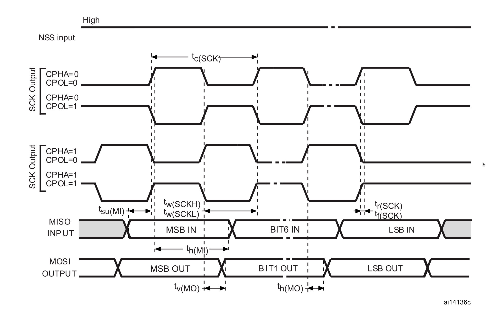
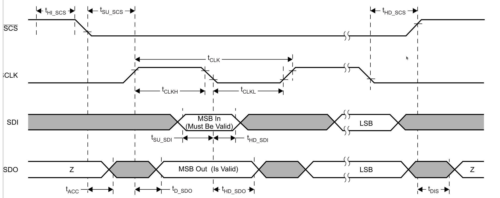
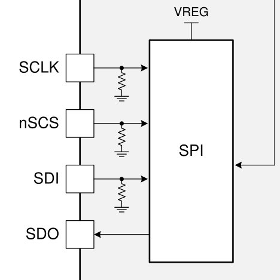
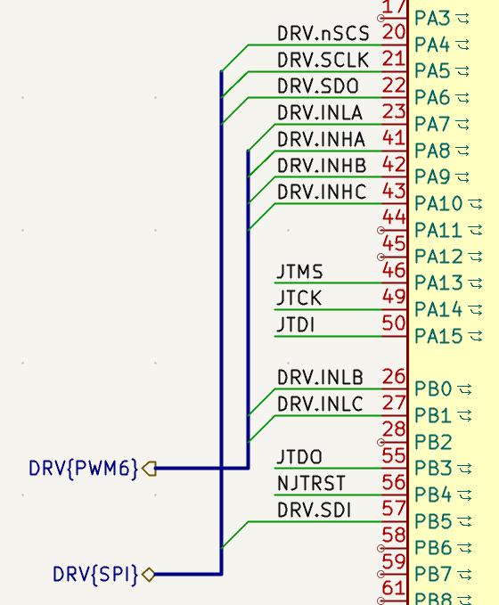
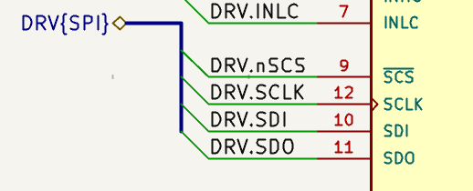
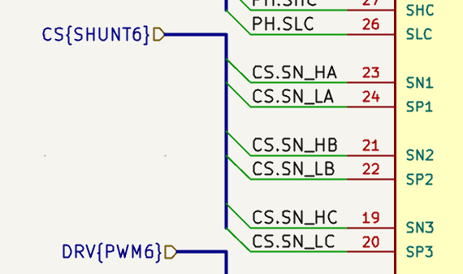

# Заняття 9: Проєктування "minimal system board"    .

## Опис завдання
У проєкті STM32CubeMX додати комунікаційні інтерфейси драйвера DRV8305 та завершити схему зворотного зв'язку по струму двигуна.

1\. У проєкті STM32CubeMX визначте SPI.

2\. Додайте на схему SPI-з'єднання між MCU і DRV8305.

3\. Заведіть сигнали з шунтів на відповідні входи драйвера відповідно до схеми включення на [с. 16 даташита DRV8305](https://drive.google.com/file/d/15we6Waadlhgk92B2uwZrcYCdEMzbCQDo/view?usp=sharing).

4\. У проєкті STM32CubeMX визначте три входи ADC — **на трьох різних ADC-периферіях**, щоб забезпечити одночасний замір усіх трьох фаз.

- На ці входи заведіть виходи вбудованих операційних підсилювачів драйвера (замір струму котушок двигуна).

- Позначте відповідні сигнали на схемі MCU та на схемі DRV8305 (SO1, SO2, SO3).

## Необов'язкова частина (за бажанням, для тренування у використанні SMD-антен на платі):

1\. Імпортуйте компонент RN4871 (або використайте з бібліотеки KiCad).

2\. Створіть схему підключення RN4871 відповідно до даташита (référence-схема підключення — с. 27).

- Захист від переполюсовки можна не використовувати.

- Reset бажано завести на вхід MCU.

3\. У проєкті STM32CubeMX визначте UART. Додайте на схему UART-з'єднання між MCU і Bluetooth-модулем RN4871.

## Рішення завдання

1\. Включаю SPI.

В меню Connectivity --> SPI1 --> встановити значення Mode в Full-Duplex Master. Одразу з'явилися нові використані піни:

- PB5 - SPI1_MOSI

- PA6 - SPI1_MISO

- PA5 - SPI1_SCK

Цікаво: так як стандартний пін для SPI1_MOSI - PA7 вже був зайнятий TIM1_CH1N, то він автоматично перепризначив його на запасний варіант - PB5. Я тут очікував помилки, що потрібно буде все виправляти вручну.

- Pull-up резистор в 1.5 кОм на лінію SDO драйвера DRV8305 для роботи SPI

Лінія SDO драйвера DRV8305 підключається до піна PA6 STM32F405RGT6. Я вказав в параметрі GPIO Pull-up/Pull-down значення Pull-up, але знайшов [інформацію](https://e2e.ti.com/support/motor-drivers-group/motor-drivers/f/motor-drivers-forum/677844/drv8305-drv8305-spi-and-sdo) що стандартних Pull-up резисторів недостатньо. Згідно datasheet їх опір, параметр Rpu (Weak pull-up equivalent resistor), складає зазвичай від 30 до 50 кОм, що не є достатніми для повноцінної передачі інформації на максимальній швидкості і рекомендують встановити окремий pull-up резистор в 1.5 кОм. Додаю його на схему.

- Додаю GPIO пін DRV_nSCS для вибора мікросхеми драйвера

Я не можу використовувати вбудований сигнал SPI1_NSS, бо в STM32F405xx в режимі master mode цей сигнал завжди у високому стані:

Крім того для нормального керування драйвером DRV8305 по шині SPI потрібно щоб значення nSCS тривало мінімально 400 мс (tHI_SCS - SCS minimum high time before SCS active low):

Додаю ручне керування вибора драйвера nSCS. Перевожу пін PA4 в режим GPIO_Output та перейменовую його в DRV_nSCS. З'єдную з nSCS драйвера DRV8305. При цьому значення властивості SPI --> Hardware NSS Signal залишаю у статусі Disabled.

- Контроль статусу DRV_nSCS (PA4) до та після ініціалізації

У властивостях піна PA4 STM32F405RGT6 встановлюємо в параметрі GPIO output level: High, щоб одразу після ініціалізації лінія була неактивною і не було короткого імпульсу в нуль. GPIO Pull-up/Pull-down залишаю як є - без Pull-up тому що внутрішній pull-up STM32 на виході нічого не дає, а на етапі до ініціалізації він не діє.

Цікаво що на інвертованому вході nSCS згідно datasheet на 7.2 Functional Block Diagram вказано що є пітяжка до землі а не до +3.3V!

Внутрішній pulldown драйвера має великий номінал 100 кОм (Rpd - Internal pulldown resistor), тож я додав би підтяжку до +3.3V з опором 10 кОм щоб надійно переважити його. Лінія буде у високому рівні з моменту подачі живлення до ініціалізації GPIO.

2\. Додав на схему SPI-з'єднання між MCU і DRV8305.

- Створив двонаправлену шину DRV{SPI} для MCU:

- Створив двонаправлену шину DRV{SPI} для драйвера:

3\. Підключаю сигнали з шунтів на відповідні входи драйвера відповідно до схеми включення.

- Створив шину CS{SHUNT6} для інвертора (додав до схеми - згідно схемі datasheet (Figure 18. Typical Application Schematic) паралельно шунту додаткові конденсатори емністю в 1000pF):

- Створив шину CS{SHUNT6} для драйвера:

