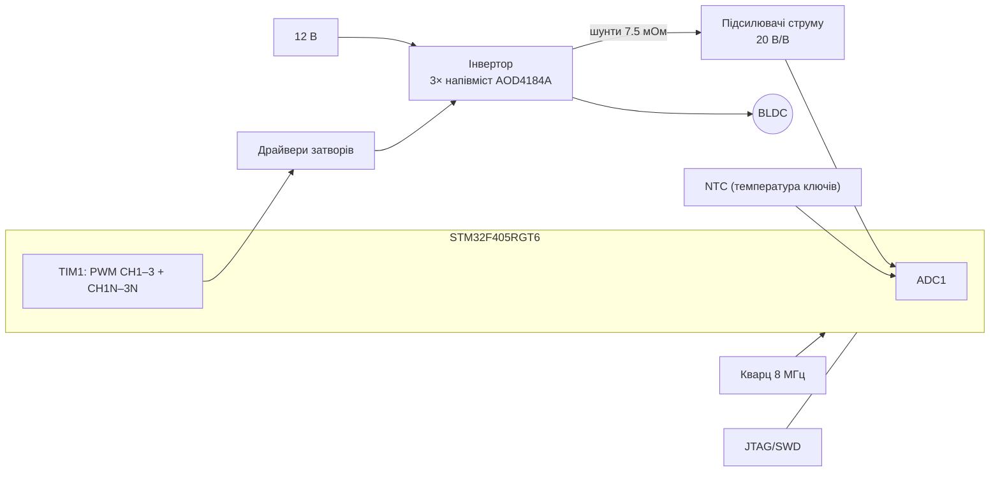

# Архітектура

## Вимоги

| Параметр | Значення | Джерело |
|----------|----------|---------|
| Напруга живлення | 12 В | ДЗ 6 |
| Потужність двигуна з навантаженням | 168 Вт (~14 А) | ДЗ 6 |
| Запас ключів за струмом / напругою | ≥ 1.5–2× / ≥ 1.5–2× (комфортно 3×) | ДЗ 6 |
| Максимальна напруга сигналу струму на вході АЦП | 3.3 В | ДЗ 6 |
