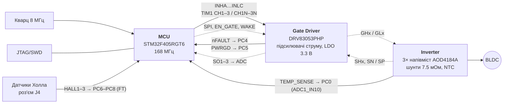
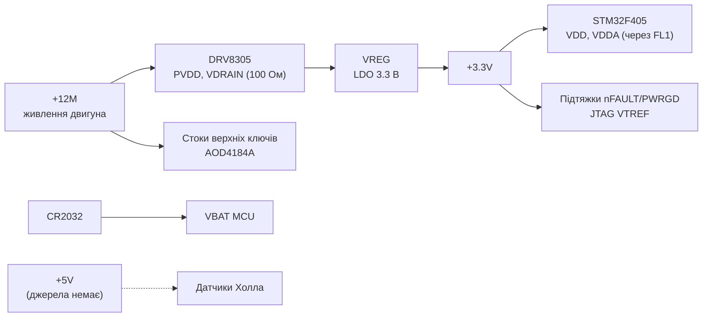

# Архітектура

Стан схеми після ДЗ 8. Суцільні лінії — з'єднання, що вже є на схемі;
пунктирні — заплановані або ще не підключені (див. [відкриті питання](design-notes.md#відкриті-питання)).

## Сигнали

Між листами сигнали поки позначені локальними мітками, тому в KiCad вони ще
не з'єднані електрично (див. ERC). На діаграмі показано задумане з'єднання.

## Живлення

Уся шина +3.3V живиться від VREG драйвера — запас струму й поведінку VREG
у режимі sleep / при аварії треба перевірити до розведення плати.

## Ключові рішення

| Вузол | Рішення | Обґрунтування |
|-------|---------|---------------|
| Силові ключі | AOD4184A, 40 В / 50 А, 5.8 мОм, TO-252 | [ДЗ 6](../../assignments/homework_06/README.md) |
| Шунти | WSR57L500FEA, 7.5 мОм, 5 Вт | [ДЗ 6](../../assignments/homework_06/README.md) |
| MCU | STM32F405RGT6: TIM1 з комплементарним ШІМ і dead-time, 3 ADC | [ДЗ 7](../../assignments/homework_07/README.md) |
| Тактування | HSE 8 МГц (AAH-181), Cext = 30 пФ, PLL → 168 МГц | [ДЗ 7](../../assignments/homework_07/README.md) |
| Драйвер затворів | DRV83053PHP: вбудовані підсилювачі струму та LDO 3.3 В, SPI | [ДЗ 8](../../assignments/homework_08/README.md) |
| Датчики Холла | PC6–PC8: FT-піни, водночас TIM3_CH1–CH3 (апаратний інтерфейс Холла) | [ДЗ 8](../../assignments/homework_08/README.md) |

Детально — у [`design-notes.md`](design-notes.md).

## Вимоги

| Параметр | Значення | Джерело |
|----------|----------|---------|
| Напруга живлення | 12 В | ДЗ 6 |
| Потужність двигуна з навантаженням | 168 Вт (~14 А) | ДЗ 6 |
| Запас ключів за струмом / напругою | ≥ 1.5–2× / ≥ 1.5–2× (комфортно 3×) | ДЗ 6 |
| Максимальна напруга сигналу струму на вході АЦП | 3.3 В | ДЗ 6 |
| Підсилення сигналу струму | 20 В/В (задається в DRV8305 через SPI) | ДЗ 6, 8 |
| Живлення логіки драйвера | +3.3V; VDRAIN — від +12M | ДЗ 8 |
